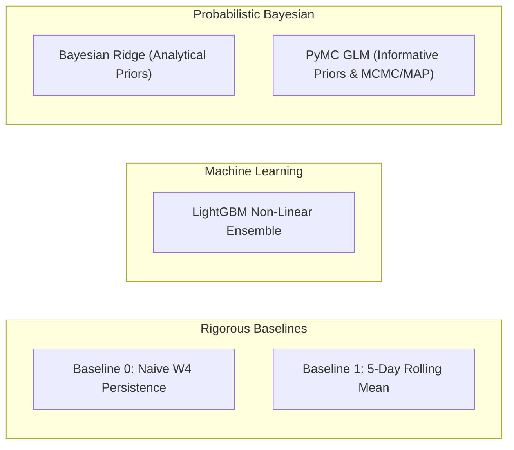

# MDK Institutional Flow Analysis & Signal Modeling Skill

This skill documents domain-specific metrics, institutional broker classifications, quantitative feature engineering, and probabilistic modeling architectures for Borsa Istanbul (BIST) centered on **Bank of America (BofA / `MLB`)**.

---

## 🤝 1. Collaborative Interaction & Modeling Workflow

Whenever designing or building a new predictive model (e.g. Model 1 `day_start`, Model 2 `intraday_expansion`, etc.):

1. **Plan Together First**:
   - Discuss the market microstructure hypothesis (e.g. "How does closing inventory affect morning opening aggression?").
   - Align on the **Feature Clusters** (zero data leakage from $T-1$ Close).
   - Agree on candidate model types and trader decision outputs (playbooks, credible ranges).
2. **Review & Confirm ("Let's Go!")**:
   - Present a clear technical implementation plan.
   - Once approved by the user, execute end-to-end with tests, pipeline DAG, and interactive notebooks.

---

## 🏛 2. Primary Institutional Target & Competitor Matrix

- **Primary Target**: **`MLB`** (Bank of America / Merrill Lynch Yatırım Bank A.Ş.) — dominant foreign algorithmic flow driver.
- **Top 5 Domestic Competitor Powerhouses**:
  - `IYM` (İş Yatırım) — largest domestic aggregator.
  - `YKR` (Yapı Kredi) — active institutional & prop desk.
  - `AKM` (Ak Yatırım) — high-volume domestic participant.
  - `GRM` (Garanti BBVA) — institutional liquidity provider.
  - `ZRY` (Ziraat) — public/state institution flow.

---

## 🎯 3. Target Variables & Modeling Rigor

In strict adherence to quantitative and mathematical rigor, targets are defined purely around the continuous net flow ($TL$) and derived directional conviction:

### Model 1: Macro Day-Start Forecaster (`DayStartForecaster`)
| Target Variable | Data Type | Mathematical Formulation | Role & Description |
| :--- | :--- | :--- | :--- |
| `target_open_net_flow_tl` | Continuous (`float64`) | $$\text{Net Flow}_{T, \text{W1}} = \sum_{i \in \text{Trades}_{T, \text{W1}, \text{MLB}}} (\text{Buy Value}_i - \text{Sell Value}_i)$$ | **Primary Training Target**: Total exchange-wide net executed capital in TL by BofA in Window 1 (09:55–10:30 TRT). |
| `target_open_direction` | Categorical (`str`) | $$\text{Direction}_T = \begin{cases} \text{BUY}, & \text{if } \text{Net Flow}_{T, \text{W1}} > 0 \\ \text{SELL}, & \text{if } \text{Net Flow}_{T, \text{W1}} \le 0 \end{cases}$$ | Derived directional binary outcome (`BUY` vs `SELL`). |

### Model 2: Sector Day-Start Allocation Forecaster (`SectorDayStartForecaster`)
| Target Variable | Data Type | Mathematical Formulation | Role & Description |
| :--- | :--- | :--- | :--- |
| `target_sector_open_net_flow_tl` | Continuous (`float64`) | $$\text{Net Flow}_{s, T, \text{W1}} = \sum_{i \in \text{Trades}_{s, T, \text{W1}, \text{MLB}}} (\text{Buy Value}_i - \text{Sell Value}_i)$$ | **Primary Training Target**: Net executed capital in TL by BofA in Sector $s$ in Window 1. |
| `target_sector_open_direction` | Categorical (`str`) | $$\text{Direction}_{s, T} = \begin{cases} \text{BUY}, & \text{if } \text{Net Flow}_{s, T, \text{W1}} > 0 \\ \text{SELL}, & \text{if } \text{Net Flow}_{s, T, \text{W1}} \le 0 \end{cases}$$ | Derived sector directional binary outcome (`BUY` vs `SELL`). |

### 💼 Business & Technical Mechanism: Unified Probabilistic Derivation
1. **Primary Regression Target**: The model fits $y = \text{target\_(sector\_)open\_net\_flow\_tl}$, outputting mean flow $\hat{\mu}$ and posterior uncertainty $\hat{\sigma}$.
2. **Harmonized Direction & Sizing (No Contradictions)**: Directional conviction ($P(\text{BUY}) = 1 - \Phi(0; \hat{\mu}, \hat{\sigma})$) and 90% credible ranges ($\hat{\mu} \pm 1.645\hat{\sigma}$) are derived directly from the exact same posterior distribution.

---

## 🧠 4. Quantitative Feature Clusters (Zero Data Leakage)

All features must be computed **strictly from $T-1$ Close data** (18:10 TRT) or prior completed intraday windows:

### A. Model 1: The 7 Macro Feature Clusters (`DayStartFeatureExtractor`)
1. **Prior Closing Window Momentum**: Window 4 net flow & turnover (`feat_bofa_w4_net_flow_tl`, `feat_bofa_w4_turnover_tl`, `feat_w4_flow_acceleration_ratio`).
2. **Multi-Day Inventory & Sector Saturation**: 5-day / 20-day rolling flows & Z-scores (`feat_bofa_cum_net_flow_5d_tl`, `feat_bofa_flow_zscore_20d`).
3. **Institutional Cost Basis & Unrealized PnL**: Spread between Close and 20d Buy VWAP (`feat_bofa_cost_basis_spread_20d_pct`).
4. **Top-5 Competitor Posture & Flow Delta**: Flow deltas vs domestic major desks `IYM`, `YKR`, `AKM`, `GRM`, `ZRY` (`feat_top5_domestic_w4_net_flow_tl`, `feat_bofa_vs_top5_w4_flow_delta_tl`).
5. **Institutional Hegemony & Market Control**: Turnover share and concentration (`feat_bofa_prev_day_market_share`, `feat_institutional_hegemony_share`, `feat_avg_cr5_concentration`).
6. **Sector Cross-Sectional Stress & Breadth**: Flow across Banking, Transportation, Holding, Energy, Defense (`feat_bofa_banking_flow_prev_day`, `feat_bofa_transport_flow_prev_day`, `feat_bofa_holding_flow_prev_day`).
7. **Calendar & Temporal Dynamics**: Day of week, Monday rebalancing, Friday hedging (`day_of_week`, `is_monday`, `is_friday`).

### B. Model 2: The 5 Sector Feature Clusters (`SectorDayStartFeatureExtractor`)
1. **Sector Prior Closing Window Momentum**: Sector Window 4 net flow and turnover (`feat_sector_bofa_w4_net_flow_tl`, `feat_sector_bofa_w4_turnover_tl`).
2. **Sector Competitor Imbalance**: BofA vs Top-5 domestic desk deltas in sector $s$ (`feat_sector_top5_w4_net_flow_tl`, `feat_sector_bofa_vs_top5_w4_delta_tl`, `feat_sector_bofa_vs_top5_daily_delta_tl`).
3. **Sector Dominance & Share of Wallet**: Sector market share and sector share of total BofA flow (`feat_sector_bofa_market_share`, `feat_sector_bofa_share_of_wallet`).
4. **Sector Multi-Day Accumulation & Saturation**: Rolling 5-day / 20-day sector cumulative flow and flow Z-scores (`feat_sector_bofa_cum_net_flow_5d_tl`, `feat_sector_top5_cum_net_flow_5d_tl`, `feat_sector_bofa_flow_zscore_20d`).
5. **Macro Context & Calendar Seasonality**: Previous day total macro BofA flow and calendar flags (`feat_macro_bofa_prev_day_net_flow_tl`, `feat_macro_top5_prev_day_net_flow_tl`, `is_monday`, `is_friday`, `day_of_week`).

---

## 🔬 5. Candidate Model Suite & Probabilistic Architecture

Every quantitative modeling objective benchmarks across 5 candidate paradigms:



1. **`NaivePersistenceModel`**: Carries yesterday's closing Window 4 flow forward.
2. **`RollingMeanModel`**: 5-day historical moving average.
3. **`LightGBMModel`**: Gradient boosting regressor capturing non-linear interactions with L2 regularization.
4. **`BayesianModel`**: Bayesian Ridge Regression with analytical conjugate priors, outputting posterior distributions and exact 90% credible intervals.
5. **`PyMCModel`**: Full Bayesian GLM with custom Gaussian shrinkage priors $\beta \sim \mathcal{N}(0, 0.5)$ and Half-Normal residual variance $\sigma \sim \text{HalfNormal}(1.0)$. Supports fast Maximum A Posteriori (MAP) fitting or full NUTS MCMC sampling.

---

## ⚔️ 6. Trailing Evaluation Horizon & Walk-Forward Validation

To prevent lookahead bias in financial time series and scale efficiently from 1 month to 5+ years of data:

```
                            FULL HISTORICAL DATASET (e.g. 1 Year / 250 Days)
┌────────────────────────────────────────────────────────┬─────────────────────────────┐
│             Rich Historical Training Base              │  Trailing Arena Tournament  │
│                     [Day 1 … 230]                      │        [Day 231 … 250]      │
│                     (230 Days)                         │        (Last 20 Days)       │
└────────────────────────────────────────────────────────┴─────────────────────────────┘
                                                                    │
Step 1:  Train on [Day 1 … 230] (230 days)  ──► Predict Day 231 ────┤ Out-of-Sample Score 1
Step 2:  Train on [Day 1 … 231] (231 days)  ──► Predict Day 232 ────┤ Out-of-Sample Score 2
...                                                                 │
Step 20: Train on [Day 1 … 249] (249 days)  ──► Predict Day 250 ────┘ Out-of-Sample Score 20
```

- **Configurable Parameters in `config/default.yaml`**:
  - `lookback_months: 12`: Trailing history window loaded relative to the latest session $T$.
  - `eval_window_days: 20`: Number of trailing out-of-sample evaluation steps in the tournament.
  - `min_burn_in_days: 5`: Minimum warmup sessions.
- **`DayStartModelArena` & `SectorDayStartModelArena`**: Runs the tournament and crowns the champion.
- **`DayStartForecaster` & `SectorDayStartForecaster`**: Fits the champion on 100% of historical data and writes forecasts into DuckDB Gold tables (`gold_bofa_day_start_forecasts` and `gold_bofa_sector_day_start_forecasts`).

---

## 🎯 7. Actionable Decision Items for Individual Traders

Continuous flow forecasts must be translated into discrete, tradeable decisions:

### A. Directional Conviction Levels
- **`STRONG_ACCUMULATE`**: Expected net flow $> +50\text{M TL}$ with conviction $\ge 70\%$.
- **`ACCUMULATE`**: Expected net flow $> +10\text{M TL}$.
- **`NEUTRAL`**: Expected net flow between $-10\text{M}$ and $+10\text{M TL}$.
- **`DISTRIBUTE`**: Expected net flow $< -10\text{M TL}$.
- **`STRONG_DISTRIBUTE`**: Expected net flow $< -50\text{M TL}$ with conviction $\ge 70\%$.

### B. Institutional Execution Playbooks
- **`SQUEEZE_LONG`**: High positive flow expectation with massive competitor flow delta ($> +30\text{M TL}$) — trade long momentum.
- **`MOMENTUM_EXPANSION`**: Large opening accumulation ($> +40\text{M TL}$) — follow early breakout.
- **`LIQUIDITY_FADE`**: High negative flow expectation with BofA holding $> +5\%$ unrealized gains — expect profit-taking / fade dips.
- **`DEFENSE_SUPPORT`**: Underwater inventory ($< -4\%$ cost basis spread) with positive flow — institutional defense zone.
- **`SECTOR_ROTATION`**: Capital shifts between Banking, Transportation, Holding, and Industrial equities.
- **`NEUTRAL_WAIT`**: Ambiguous flow — wait for Window 2 intraday confirmation.

---

## 🚀 8. Live Next-Day Inference vs. Historical Backtesting Architecture ($T+1$ vs $T$)

A common flaw in quantitative modeling pipelines is confusing historical evaluation with live inference. In **MDK Trading Oracle**, this separation is mathematically and architecturally strict:

```
                                      TIMING TAXONOMY & EXECUTION FLOW
                      
1. Historical Training / Backtest (Sessions 1 … T):
   ┌────────────────────────────────────────────────────────┐
   │ Session D_{k-1} Close (18:10 TRT)                      │  ─── Evaluated as LAG(..., 1) in SQL
   │ [W4 Momentum] + [5d/20d Accum] + [Competitor Deltas]   │
   └──────────────────────────┬─────────────────────────────┘
                              │ Predicts
                              ▼
   ┌────────────────────────────────────────────────────────┐
   │ Session D_k Window 1 (09:55 - 10:30 TRT)               │  ─── Target y = target_open_net_flow_tl (KNOWN)
   └────────────────────────────────────────────────────────┘

2. Live Next-Day Inference (Upcoming Session T+1):
   ┌────────────────────────────────────────────────────────┐
   │ Session T Close (Latest Available Date at 18:10 TRT)   │  ─── Evaluated UNLAGGED directly at T Close
   │ [W4 Momentum] + [5d/20d Accum] + [Competitor Deltas]   │
   └──────────────────────────┬─────────────────────────────┘
                              │ Predicts
                              ▼
   ┌────────────────────────────────────────────────────────┐
   │ Session T+1 Window 1 (Tomorrow Morning 09:55 TRT)      │  ─── Target y = NULL (UNKNOWN FUTURE)
   │ Output: Live Signal Card, Direction, Playbook, CI      │
   └────────────────────────────────────────────────────────┘
```

### Key Engineering Standards:
1. **Business Day Progression**: Use `get_next_trading_day(latest_date)` to automatically advance to the next legitimate trading date (e.g. Friday $T \rightarrow$ Monday $T+1$).
2. **`extract_next_day_features()`**: Evaluates rolling metrics directly at latest close ($T$) without target variables or LAG windowing.
3. **Dual Forecaster Methods**:
   - `forecaster.forecast_next_day()`: Real-time live inference on $T+1$ flow.
   - `forecaster.backtest_all_history()`: Out-of-sample simulation across past sessions for calibration without polluting production forecast history.
4. **Idempotent Primary Key Upsert**:
   - Persisting via `INSERT OR REPLACE` into DuckDB Gold tables (`gold_bofa_day_start_forecasts` and `gold_bofa_sector_day_start_forecasts`) allows daily pipeline runs to record tomorrow's forecast, organically accumulating an immutable historical ledger day by day as tomorrow becomes today.

---

## 📓 9. Interactive Research Notebook Standards & Dual Presentation

Every model exploration notebook (e.g. `03_bofa_day_start_modeling.ipynb`, `04_bofa_sector_day_start_modeling.ipynb`) adheres to these presentation rules:

1. **Dynamic On-The-Fly Model Arena**:
   - Never hardcode the champion model in research notebooks. Always instantiate `DayStartModelArena()` / `SectorDayStartModelArena()` and run `.run_tournament(X, y)` to crown the champion on the fly based on walk-forward performance.
2. **Prominent Live Upcoming Session Card ($T+1$)**:
   - Positioned prominently before historical charts. Displays upcoming date, predicted flow ($TL$), 90% credible intervals, directional conviction badges (`STRONG_ACCUMULATE`, `DISTRIBUTE`), institutional playbooks, and sector allocation bar charts.
3. **Historical Backtest & Calibration Explorer**:
   - Visualizes actual vs. predicted curves with 90% confidence ribbons and interactive dropdown inspectors for examining past session performance.
4. **DuckDB Gold Verification**:
   - Queries `gold_bofa_*_forecasts` using `read_only=True` to audit persisted production records.

