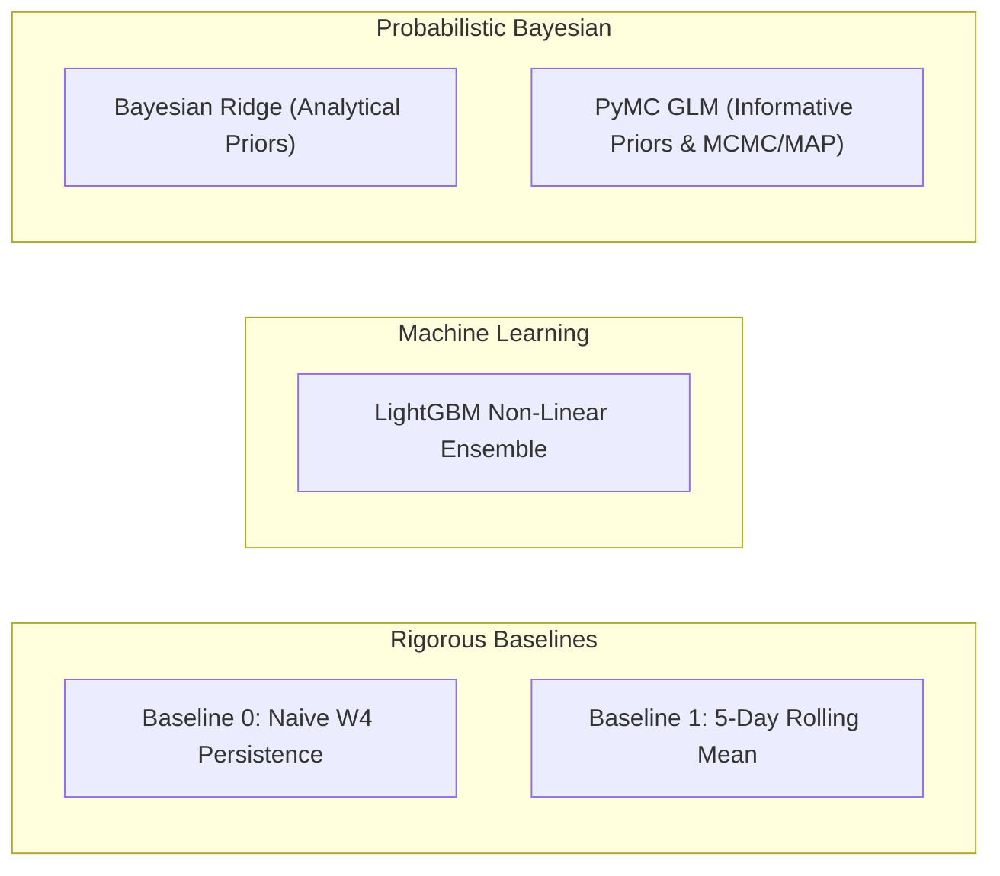
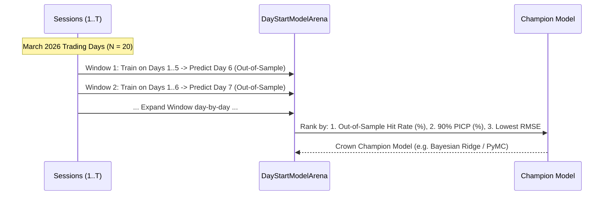

# MDK Institutional Flow Analysis & Signal Modeling Skill

This skill documents domain-specific metrics, institutional broker classifications, quantitative feature engineering, and probabilistic modeling architectures for Borsa Istanbul (BIST) centered on **Bank of America (BofA / `MLB`)**.

---

## 🤝 1. Collaborative Interaction & Modeling Workflow

Whenever designing or building a new predictive model (e.g. Model 1 `day_start`, Model 2 `intraday_expansion`, etc.):

1. **Plan Together First**:
   - Discuss the market microstructure hypothesis (e.g. "How does closing inventory affect morning opening aggression?").
   - Align on the **Feature Clusters** (zero data leakage from $T-1$ Close).
   - Agree on candidate model types and trader decision outputs (playbooks, credible ranges).
2. **Review & Confirm ("Let's Go!")**:
   - Present a clear technical implementation plan.
   - Once approved by the user, execute end-to-end with tests, pipeline DAG, and interactive notebooks.

---

## 🏛 2. Primary Institutional Target & Competitor Matrix

- **Primary Target**: **`MLB`** (Bank of America / Merrill Lynch Yatırım Bank A.Ş.) — dominant foreign algorithmic flow driver.
- **Top 5 Domestic Competitor Powerhouses**:
  - `IYM` (İş Yatırım) — largest domestic aggregator.
  - `YKR` (Yapı Kredi) — active institutional & prop desk.
  - `AKM` (Ak Yatırım) — high-volume domestic participant.
  - `GRM` (Garanti BBVA) — institutional liquidity provider.
  - `ZRY` (Ziraat) — public/state institution flow.

---

## 🎯 3. Target Variables & Multi-Target Architecture

The model trains against actual executed trade metrics extracted from DuckDB Silver table `silver_intraday_broker_window_summary` for **Window 1 (`day_start`)**:

| Target Variable | Data Type | Mathematical Formulation | Role & Description |
| :--- | :--- | :--- | :--- |
| `target_open_net_flow_tl` | Continuous (`float64`) | $$\text{Net Flow}_{T, \text{W1}} = \sum_{i \in \text{Trades}_{T, \text{W1}, \text{MLB}}} (\text{Buy Value}_i - \text{Sell Value}_i)$$ | **Primary Training Target**: Net executed capital in TL by BofA in Window 1. |
| `target_open_direction` | Categorical (`str`) | $$\text{Direction}_T = \begin{cases} \text{BUY}, & \text{if } \text{Net Flow}_{T, \text{W1}} > 0 \\ \text{SELL}, & \text{if } \text{Net Flow}_{T, \text{W1}} \le 0 \end{cases}$$ | Directional binary outcome (`BUY` vs `SELL`). |
| `target_open_turnover_tl` | Continuous (`float64`) | $$\text{Turnover}_{T, \text{W1}} = \sum (\text{Buy Value}_i + \text{Sell Value}_i)$$ | Total gross executed volume (TL) by BofA in Window 1 (Audit benchmark). |
| `target_open_market_share` | Continuous (`float64`) | $$\text{Market Share}_{T, \text{W1}} = \frac{\text{Turnover}_{\text{MLB}, T, \text{W1}}}{\text{Turnover}_{\text{Market}, T, \text{W1}}}$$ | BofA's opening liquidity dominance ratio across all brokers. |

### 💼 Business & Technical Mechanism: Unified Probabilistic Derivation
1. **Primary Regression Target**: The model fits $y = \text{target\_open\_net\_flow\_tl}$, outputting mean flow $\hat{\mu}$ and posterior uncertainty $\hat{\sigma}$.
2. **Harmonized Direction & Sizing (No Contradictions)**: Directional conviction ($P(\text{BUY}) = 1 - \Phi(0; \hat{\mu}, \hat{\sigma})$) and 90% credible ranges ($\hat{\mu} \pm 1.645\hat{\sigma}$) are derived directly from the exact same posterior distribution.

---

## 🧠 4. The 7 Quantitative Feature Clusters (Zero Data Leakage)

All features must be computed **strictly from $T-1$ Close data** (or prior completed intraday windows):

| Feature Cluster | Core Domain Logic & Rationale | Key Features |
| :--- | :--- | :--- |
| **Cluster 1: Prior Closing Window Momentum** | Unfinished institutional VWAP/MOC programs in Window 4 (17:00-18:10) carry over into next morning's opening auction. | `feat_bofa_w4_net_flow_tl` `feat_bofa_w4_share` `feat_bofa_w4_vwap_spread_pct` |
| **Cluster 2: Multi-Day Inventory & Sector Saturation** | Institutional exposure limits: after 3-5 consecutive days of net buying in a sector, algorithms face risk thresholds. | `feat_bofa_accum_5d_tl` `feat_bofa_accum_20d_tl` `feat_bofa_flow_zscore_20d` |
| **Cluster 3: Cost Basis & Unrealized PnL** | Distance between yesterday's close and BofA's 20-day Volume-Weighted Buy Price (VWAP). Large profits trigger distribution; underwater positions trigger defense. | `feat_bofa_cost_basis_spread_20d_pct` `feat_bofa_buy_vwap_20d` |
| **Cluster 4: Top-5 Competitor Posture & Flow Delta** | Flow imbalance between BofA and domestic major brokers (`IYM`, `YKR`, `AKM`, `GRM`, `ZRY`). | `feat_top5_w4_net_flow_tl` `feat_bofa_vs_top5_w4_flow_delta_tl` |
| **Cluster 5: Institutional Hegemony & Market Control** | Overall daily turnover dominance and share of market liquidity. | `feat_bofa_prev_day_market_share` `feat_bofa_prev_day_turnover_tl` |
| **Cluster 6: Sector Cross-Sectional Stress & Breadth** | Leading sector rotation indicators across Banking, Transportation, Holding, and Industrial equities. | `feat_bofa_banking_flow_prev_day` `feat_bofa_transport_flow_prev_day` `feat_bofa_holding_flow_prev_day` |
| **Cluster 7: Calendar & Temporal Dynamics** | Weekly institutional mandate dynamics: Monday morning re-allocations vs Friday closing hedges. | `day_of_week` `is_monday` `is_friday` |

---

## 🔬 4. Candidate Model Suite & Probabilistic Architecture

Every quantitative model objective benchmarks across 5 candidate paradigms:

1. **`DayStartNaivePersistenceModel`**: Carries yesterday's closing Window 4 flow forward.
2. **`DayStartRollingMeanModel`**: 5-day historical moving average.
3. **`DayStartLightGBMModel`**: Gradient boosting regressor capturing non-linear interactions with L2 regularization.
4. **`DayStartBayesianModel`**: Bayesian Ridge Regression with analytical conjugate priors, outputting posterior distributions and exact 90% credible intervals.
5. **`DayStartPyMCModel`**: Full Bayesian GLM with custom Gaussian shrinkage priors $\beta \sim \mathcal{N}(0, 0.5)$ and Half-Normal residual variance $\sigma \sim \text{HalfNormal}(1.0)$. Supports fast Maximum A Posteriori (MAP) fitting or full NUTS MCMC sampling.

---

## ⚔️ 5. Expanding-Window Walk-Forward Validation & Auto-Arena

To prevent lookahead bias in financial time series, models are evaluated chronologically:

- **`DayStartModelArena.run_tournament(X, y)`**: Runs the tournament and crowns the champion.
- **`DayStartForecaster(model_type="auto")`**: Production orchestrator that runs the arena on the fly and persists forecasts into DuckDB Gold table `gold_bofa_day_start_forecasts`.

---

## 🎯 6. Actionable Decision Items for Individual Traders

Continuous flow forecasts must be translated into discrete, tradeable decisions:

### A. Directional Conviction Levels
- **`STRONG_ACCUMULATE`**: Expected net flow $> +50\text{M TL}$ with conviction $\ge 70\%$.
- **`ACCUMULATE`**: Expected net flow $> +10\text{M TL}$.
- **`NEUTRAL`**: Expected net flow between $-10\text{M}$ and $+10\text{M TL}$.
- **`DISTRIBUTE`**: Expected net flow $< -10\text{M TL}$.
- **`STRONG_DISTRIBUTE`**: Expected net flow $< -50\text{M TL}$ with conviction $\ge 70\%$.

### B. Institutional Execution Playbooks
- **`SQUEEZE_LONG`**: High positive flow expectation with massive competitor flow delta ($> +30\text{M TL}$) — trade long momentum.
- **`MOMENTUM_EXPANSION`**: Large opening accumulation ($> +40\text{M TL}$) — follow early breakout.
- **`LIQUIDITY_FADE`**: High negative flow expectation with BofA holding $> +5\%$ unrealized gains — expect profit-taking / fade dips.
- **`DEFENSE_SUPPORT`**: Underwater inventory ($< -4\%$ cost basis spread) with positive flow — institutional defense zone.
- **`SECTOR_ROTATION`**: Monday morning capital shifts between Banking and Transportation.
- **`NEUTRAL_WAIT`**: Ambiguous flow — wait for Window 2 intraday confirmation.
