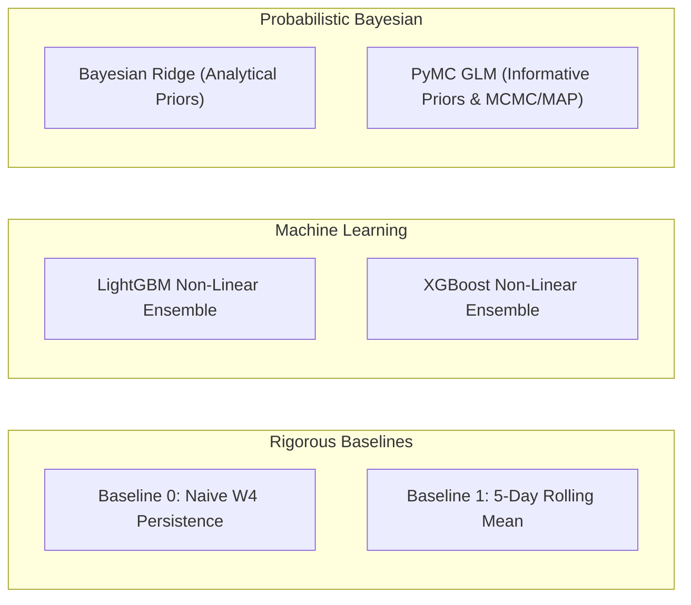

# MDK Institutional Flow Analysis & Signal Modeling Skill

This skill documents domain-specific metrics, institutional broker classifications, quantitative feature engineering, and probabilistic modeling architectures for Borsa Istanbul (BIST) centered on **Bank of America (BofA / `MLB`)**.

---

## 1. Collaborative Interaction & Modeling Workflow

Whenever designing or building a new predictive model (e.g. Model 1 `day_start`, Model 2 `intraday_expansion`, etc.):

1. **Plan Together First**:
   - Discuss the market microstructure hypothesis (e.g. "How does closing inventory affect morning opening aggression?").
   - Align on the **Feature Clusters** (zero data leakage from $T-1$ Close).
   - Agree on candidate model types and trader decision outputs (playbooks, credible ranges).
2. **Review & Confirm ("Let's Go!")**:
   - Present a clear technical implementation plan.
   - Once approved by the user, execute end-to-end with tests, pipeline DAG, and interactive notebooks.

---

## 2. Primary Institutional Target & Competitor Matrix

- **Primary Target**: **`MLB`** (Bank of America / Merrill Lynch Yatırım Bank A.Ş.) — dominant foreign algorithmic flow driver.
- **Top 5 Domestic Competitor Powerhouses**:
  - `IYM` (İş Yatırım) — largest domestic aggregator.
  - `YKR` (Yapı Kredi) — active institutional & prop desk.
  - `AKM` (Ak Yatırım) — high-volume domestic participant.
  - `GRM` (Garanti BBVA) — institutional liquidity provider.
  - `ZRY` (Ziraat) — public/state institution flow.

---

## 3. Target Variables & Modeling Rigor

In strict adherence to quantitative and mathematical rigor, targets are defined purely around the continuous net flow ($TL$) and derived directional conviction:

### Model 1: Macro Day-Start Forecaster (`DayStartForecaster`)
| Target Variable | Data Type | Mathematical Formulation | Role & Description |
| :--- | :--- | :--- | :--- |
| `target_open_net_flow_tl` | Continuous (`float64`) | $$\text{Net Flow}_{T, \text{W1}} = \sum_{i \in \text{Trades}_{T, \text{W1}, \text{MLB}}} (\text{Buy Value}_i - \text{Sell Value}_i)$$ | **Primary Training Target**: Total exchange-wide net executed capital in TL by BofA in Window 1 (09:55–10:30 TRT). |
| `target_open_direction` | Categorical (`str`) | $$\text{Direction}_T = \begin{cases} \text{BUY}, & \text{if } \text{Net Flow}_{T, \text{W1}} > 0 \\ \text{SELL}, & \text{if } \text{Net Flow}_{T, \text{W1}} \le 0 \end{cases}$$ | Derived directional binary outcome (`BUY` vs `SELL`). |

### Model 2: Sector Day-Start Allocation Forecaster (`SectorDayStartForecaster`)
| Target Variable | Data Type | Mathematical Formulation | Role & Description |
| :--- | :--- | :--- | :--- |
| `target_sector_open_net_flow_tl` | Continuous (`float64`) | $$\text{Net Flow}_{s, T, \text{W1}} = \sum_{i \in \text{Trades}_{s, T, \text{W1}, \text{MLB}}} (\text{Buy Value}_i - \text{Sell Value}_i)$$ | **Primary Training Target**: Net executed capital in TL by BofA in Sector $s$ in Window 1. |
| `target_sector_open_direction` | Categorical (`str`) | $$\text{Direction}_{s, T} = \begin{cases} \text{BUY}, & \text{if } \text{Net Flow}_{s, T, \text{W1}} > 0 \\ \text{SELL}, & \text{if } \text{Net Flow}_{s, T, \text{W1}} \le 0 \end{cases}$$ | Derived sector directional binary outcome (`BUY` vs `SELL`). |

### Model 3: BIST30 Stock Intraday Reaction Forecaster (`StockReactionForecaster`)
| Target Variable | Data Type | Mathematical Formulation | Role & Description |
| :--- | :--- | :--- | :--- |
| `target_w2_return_pct` | Continuous (`float64`) | $$y_{i, \text{W2}} = \frac{\text{VWAP}_{i, \text{W2}} - P_{i, \text{W1\_ref}}}{P_{i, \text{W1\_ref}}} \times 100$$ | **Primary Training Target (W2)**: Execution-aware return % from W1 ref price to Window 2 (10:30–11:30 TRT) VWAP. |
| `target_w3_return_pct` | Continuous (`float64`) | $$y_{i, \text{W3}} = \frac{\text{VWAP}_{i, \text{W3}} - P_{i, \text{W1\_ref}}}{P_{i, \text{W1\_ref}}} \times 100$$ | **Primary Training Target (W3)**: Execution-aware return % from W1 ref price to Window 3 (11:30–14:30 TRT) VWAP. |
| `target_w5_return_pct` | Continuous (`float64`) | $$y_{i, \text{W5}} = \frac{\text{VWAP}_{i, \text{W5}} - P_{i, \text{W1\_ref}}}{P_{i, \text{W1\_ref}}} \times 100$$ | **Primary Training Target (W5)**: Execution-aware return % from W1 ref price to Window 5 (16:00–18:15 TRT) VWAP. |

### Business & Technical Mechanism: Unified Probabilistic Derivation
1. **Primary Regression Target**: The model fits continuous targets, outputting predicted value $\hat{\mu}$ and posterior uncertainty $\hat{\sigma}$.
2. **Harmonized Direction & Sizing (No Contradictions)**: Directional conviction and 90% credible ranges ($\hat{\mu} \pm 1.645\hat{\sigma}$) are derived directly from the exact same posterior distribution.

---

## 4. Quantitative Feature Clusters (Zero Data Leakage)

All features must be computed **strictly from $T-1$ Close data** (18:10 TRT) or completed intraday Window 1 (10:30 TRT). Full mathematical formulations, microstructure hypotheses, and default definitions are maintained in model-level documentation:
- **Macro Day-Start Specification**: [`src/mdk_trading_oracle/models/day_start/FEATURES.md`](file:///Users/ozkanyildirim/.gemini/antigravity-ide/scratch/mdk-trading-oracle/src/mdk_trading_oracle/models/day_start/FEATURES.md)
- **Sector Day-Start Specification**: [`src/mdk_trading_oracle/models/sector_day_start/FEATURES.md`](file:///Users/ozkanyildirim/.gemini/antigravity-ide/scratch/mdk-trading-oracle/src/mdk_trading_oracle/models/sector_day_start/FEATURES.md)
- **Stock Reaction Specification**: [`src/mdk_trading_oracle/models/stock_reaction/FEATURES.md`](file:///Users/ozkanyildirim/.gemini/antigravity-ide/scratch/mdk-trading-oracle/src/mdk_trading_oracle/models/stock_reaction/FEATURES.md)

### A. Model 1: The 10 Macro Feature Clusters (45 Features — `DayStartFeatureExtractor`)
1. **Prior Closing Window Momentum**: Window 4 net flow & turnover (`feat_bofa_w4_net_flow_tl`, `feat_bofa_w4_turnover_tl`, `feat_w4_flow_acceleration_ratio`).
2. **Multi-Day Inventory & Macro Saturation**: 5-day / 20-day rolling flows & Z-scores (`feat_bofa_prev_day_net_flow_tl`, `feat_bofa_prev_day_turnover_tl`, `feat_bofa_prev_day_market_share`, `feat_bofa_prev_day_turnover_rank`, `feat_bofa_cum_net_flow_5d_tl`, `feat_bofa_flow_zscore_20d`).
3. **Institutional Cost Basis & Unrealized PnL**: Spread between Close and 20d Buy VWAP / FIFO average cost (`feat_bofa_cost_basis_spread_20d_pct`, `feat_prev_day_close_vs_vwap_spread_pct`).
4. **Top-5 Competitor Posture & Flow Delta**: Flow deltas vs domestic major desks `IYM`, `YKR`, `AKM`, `GRM`, `ZRY` (`feat_top5_domestic_w4_net_flow_tl`, `feat_top5_domestic_prev_day_net_flow_tl`, `feat_bofa_vs_top5_w4_flow_delta_tl`, `feat_bofa_vs_top5_total_flow_delta_tl`, `feat_top5_cum_net_flow_5d_tl`).
5. **Institutional Hegemony & Market Control**: Turnover share and concentration (`feat_institutional_hegemony_share`, `feat_avg_cr5_concentration`).
6. **Sector Breadth & Prior Day Sector Flows**: Flow across Banking, Transportation, Holding, Energy, Defense, and market breadth (`feat_market_avg_return_pct`, `feat_market_avg_range_pct`, `feat_bofa_banking_flow_prev_day`, `feat_bofa_transport_flow_prev_day`, `feat_bofa_holding_flow_prev_day`, `feat_bofa_energy_flow_prev_day`, `feat_bofa_defense_flow_prev_day`, `feat_top5_banking_flow_prev_day`).
7. **Calendar Dynamics**: Day of week, Monday rebalancing, Friday hedging (`day_of_week`, `is_monday`, `is_friday`).
8. **Macro Interest Rate Dynamics**: Prevailing Central Bank (TCMB) 1-week repo policy rate, rate deltas, decision day flags, days elapsed since last rate hike/cut, rate spread vs 30-day mean, and daily carry cost bps (`feat_macro_interest_rate`, `feat_macro_rate_shock_decay`, `feat_macro_rate_spread_vs_30d_mean`, `feat_macro_daily_carry_cost_bps`).
9. **Benchmark Index (BIST 30) Momentum & Volatility**: Official BIST 30 (`XU030`) 1-day / 5-day return, intraday price range %, trend vs 20d SMA, and 20-day return volatility (`feat_bist30_prev_day_return_pct`, `feat_bist30_prev_day_intraday_return_pct`, `feat_bist30_prev_day_range_pct`, `feat_bist30_cum_return_5d`, `feat_bist30_trend_vs_20d_sma`, `feat_bist30_volatility_20d`).
10. **Institutional FIFO Tertip & Overnight Inventory**: Overnight carried inventory value ($TL$), mark-to-market unrealized PnL ($TL$), unrealized return %, carry FIFO realized PnL, intraday matched PnL, and BofA vs Top-5 domestic inventory delta (`feat_bofa_net_open_inventory_tl`, `feat_bofa_unrealized_pnl_tl`, `feat_bofa_unrealized_pnl_return_pct`, `feat_bofa_carry_fifo_pnl_prev_day_tl`, `feat_bofa_intraday_pnl_prev_day_tl`, `feat_bofa_vs_top5_inventory_delta_tl`).

### B. Model 2: The 7 Sector Feature Clusters (32 Features — `SectorDayStartFeatureExtractor`)
1. **Sector Prior Closing Window Momentum**: Sector Window 4 net flow, turnover, and competitor delta (`feat_sector_bofa_w4_net_flow_tl`, `feat_sector_bofa_w4_turnover_tl`, `feat_sector_top5_w4_net_flow_tl`, `feat_sector_bofa_vs_top5_w4_delta_tl`).
2. **Sector Competitor Imbalance**: BofA vs Top-5 domestic desk deltas and daily flows in sector $s$ (`feat_sector_bofa_prev_day_net_flow_tl`, `feat_sector_bofa_prev_day_turnover_tl`, `feat_sector_top5_prev_day_net_flow_tl`, `feat_sector_bofa_vs_top5_daily_delta_tl`).
3. **Sector Dominance & Share of Wallet**: Sector market share, sector share of total BofA flow, and macro context flows (`feat_sector_bofa_market_share`, `feat_sector_bofa_share_of_wallet`, `feat_macro_bofa_prev_day_net_flow_tl`, `feat_macro_top5_prev_day_net_flow_tl`).
4. **Sector Multi-Day Accumulation & Saturation**: Rolling 5-day / 20-day sector cumulative flow and flow Z-scores (`feat_sector_bofa_cum_net_flow_5d_tl`, `feat_sector_top5_cum_net_flow_5d_tl`, `feat_sector_bofa_flow_zscore_20d`).
5. **Macro Context, Rates & Seasonality**: Prevailing Central Bank policy rate, rate shock decay bps, rate spread vs 30-day mean, sector rate $\times$ flow interaction, and calendar flags (`feat_macro_interest_rate`, `feat_macro_rate_shock_decay`, `feat_macro_rate_spread_vs_30d_mean`, `feat_sector_rate_x_flow_interaction`, `day_of_week`, `is_monday`, `is_friday`).
6. **Sector Relative Alpha & Benchmark Interaction**: Sector excess return over BIST 30 index (1-day alpha, 5-day alpha), broad market return/volatility, and sector beta-momentum interaction (`feat_sector_rel_return_vs_bist30_1d`, `feat_sector_rel_return_vs_bist30_5d`, `feat_bist30_market_return_1d`, `feat_bist30_market_range_pct`, `feat_sector_beta_x_bist30_momentum`).
7. **Sector Institutional FIFO Tertip & Inventory**: Sector net carried inventory value ($TL$), sector inventory share of total BofA wallet, sector unrealized PnL ($TL$), sector unrealized return %, and BofA vs Top-5 domestic sector inventory delta (`feat_sector_bofa_net_inventory_tl`, `feat_sector_bofa_inventory_wallet_share`, `feat_sector_bofa_unrealized_pnl_tl`, `feat_sector_bofa_unrealized_pnl_return_pct`, `feat_sector_bofa_vs_top5_inventory_delta_tl`).

### C. Model 3: The 8 Stock Reaction Feature Clusters (58 Features — `StockReactionFeatureExtractor`)
1. **BofA W1 Execution Signal (10 features)**: Buy/sell volume, turnover TL, net flow TL, net lot volume, volume share %, direction sign, quantile strength tier, and market W1 VWAP (`feat_bofa_w1_buy_vol`, `feat_bofa_w1_sell_vol`, `feat_bofa_w1_buy_tl`, `feat_bofa_w1_sell_tl`, `feat_bofa_w1_net_flow_tl`, `feat_bofa_w1_net_vol`, `feat_bofa_w1_vol_share`, `feat_bofa_w1_direction_sign`, `feat_bofa_w1_direction_strength`, `feat_bofa_w1_market_vwap`).
2. **Multi-Broker W1 Alignment & Retail Contra-Signal (10 features)**: Domestic Top-5 (`IYM`, `YKR`, `AKM`, `GRM`, `ZRY`) + `TRA` W1 net flows, competitor direction strength tier, institutional alignment sign, and TRA retail panic contra-signal (`feat_comp_w1_net_flow_tl`, `feat_comp_w1_direction_strength`, `feat_iym_w1_net_flow_tl`, `feat_ykr_w1_net_flow_tl`, `feat_akm_w1_net_flow_tl`, `feat_grm_w1_net_flow_tl`, `feat_zry_w1_net_flow_tl`, `feat_tra_w1_net_flow_tl`, `feat_w1_bofa_comp_alignment`, `feat_w1_bofa_tra_contra_signal`).
3. **T-1 Stock Momentum & Technical Posture (14 features)**: Compounded 1d/3d/5d/20d returns, SMA5/SMA20 distance %, fast vs slow SMA spread %, 5-day range position [0, 1], candle close location [0, 1], intraday range %, 20d return volatility, 5d/20d volatility compression ratio, 5d RVOL, and 5d relative return alpha vs BIST 30 (`feat_stock_ret_t1_1d`, `feat_stock_ret_t1_3d`, `feat_stock_ret_t1_5d`, `feat_stock_ret_t1_20d`, `feat_stock_dist_sma5_t1`, `feat_stock_dist_sma20_t1`, `feat_stock_sma5_vs_sma20_spread_t1`, `feat_stock_pos_in_5d_range_t1`, `feat_stock_close_loc_t1`, `feat_stock_intraday_range_t1`, `feat_stock_vol_20d_t1`, `feat_stock_vol_ratio_5d_20d_t1`, `feat_stock_rvol_5d_t1`, `feat_stock_rel_bist30_ret_5d_t1`).
4. **T-1 Institutional FIFO Inventory Posture (7 features)**: BofA, TRA, and Domestic Top-5 carried inventory quantity, cost basis spread %, and unrealized PnL TL (`feat_bofa_t1_open_qty`, `feat_bofa_t1_cost_spread_pct`, `feat_bofa_t1_unrealized_pnl_tl`, `feat_tra_t1_open_qty`, `feat_tra_t1_cost_spread_pct`, `feat_dom5_t1_open_qty`, `feat_dom5_t1_unrealized_pnl_tl`).
5. **T-1 Multi-Day Accumulation & Broker Deltas (5 features)**: 5d/20d rolling accumulation, 20d flow Z-score, Top-5 5d flow, and BofA vs Competitor flow delta (`feat_bofa_accum_5d_t1_tl`, `feat_bofa_accum_20d_t1_tl`, `feat_bofa_flow_zscore_t1`, `feat_comp_accum_5d_t1_tl`, `feat_bofa_comp_delta_t1_tl`).
6. **T-1 Sector Breadth & Peer Relative Spread (3 features)**: Sector return 1d, sector BofA flow TL, and peer alpha spread (`feat_sector_ret_t1`, `feat_sector_bofa_flow_t1`, `feat_peer_spread_t1`).
7. **Macro Interest Rates & Carry Dynamics (5 features)**: TCMB policy repo rate, rate change delta, days elapsed since MPC decision, daily carry cost %, and policy shock decay amplitude (`feat_macro_repo_rate_t1`, `feat_macro_rate_delta_t1`, `feat_macro_days_since_decision_t1`, `feat_macro_carry_t1`, `feat_macro_rate_shock_decay_t1`).
8. **Calendar & Temporal Seasonality (4 features)**: Day of week, Monday, Friday, and day of month (`feat_day_of_week`, `feat_is_monday`, `feat_is_friday`, `feat_day_of_month`).

---

## 5. Institutional FIFO Tertip Mechanism & Inventory Dynamics (`INTRADAY_MATCHED_FIFO_V1`)

To model how institutional desks manage carry inventory across trading days:
- **Intraday Match vs. Overnight Carry**: Day $T$ buy and sell executions are matched intraday at respective VWAPs ($min(\text{buy}, \text{sell})$) creating `intraday_realized_pnl_tl`.
- **Residual Directional Queue**: The remaining daily net volume $(\text{buy} - \text{sell})$ enters or consumes the existing FIFO lot queue (`silver_broker_fifo_lots`).
- **Point-in-Time Daily History**: `silver_broker_fifo_daily` stores the position state (`LONG`, `SHORT`, `FLAT`), open stock quantity, FIFO cost basis, and unrealized MTM PnL for every single date $T$.
- **Downstream Alpha**: Knowing whether BofA or major competitor desks enter session $T+1$ with heavily saturated inventory or deep unrealized gains/losses provides powerful predictive signals for morning liquidation pressures, short squeezes, and defense accumulation.


---

---

## 6. Candidate Model Suite & Probabilistic Architecture

Every quantitative modeling objective benchmarks across 6 candidate paradigms:



1. **`NaivePersistenceModel`**: Carries yesterday's closing Window 4 flow forward.
2. **`RollingMeanModel`**: 5-day historical moving average.
3. **`LightGBMModel`**: Gradient boosting regressor capturing non-linear interactions with fast histogram binning and L2 regularization.
4. **`XGBoostModel`**: Gradient boosting regressor using exact second-order Taylor expansion gradients with L1/L2 regularization and feature subsampling.
5. **`BayesianModel`**: Bayesian Ridge Regression with analytical conjugate priors, outputting posterior distributions and exact 90% credible intervals.
6. **`PyMCModel`**: Full Bayesian GLM with custom Gaussian shrinkage priors $\beta \sim \mathcal{N}(0, 0.5)$ and Half-Normal residual variance $\sigma \sim \text{HalfNormal}(1.0)$. Supports fast Maximum A Posteriori (MAP) fitting or full NUTS MCMC sampling.

---

## 7. Trailing Evaluation Horizon & Walk-Forward Validation

To prevent lookahead bias in financial time series and scale efficiently from 1 month to 5+ years of data:

```
                            FULL HISTORICAL DATASET (e.g. 1 Year / 250 Days)
┌────────────────────────────────────────────────────────┬─────────────────────────────┐
│             Rich Historical Training Base              │  Trailing Arena Tournament  │
│                     [Day 1 … 230]                      │        [Day 231 … 250]      │
│                     (230 Days)                         │        (Last 20 Days)       │
└────────────────────────────────────────────────────────┴─────────────────────────────┘
                                                                    │
Step 1:  Train on [Day 1 … 230] (230 days)  ──► Predict Day 231 ────┤ Out-of-Sample Score 1
Step 2:  Train on [Day 1 … 231] (231 days)  ──► Predict Day 232 ────┤ Out-of-Sample Score 2
...                                                                 │
Step 20: Train on [Day 1 … 249] (249 days)  ──► Predict Day 250 ────┘ Out-of-Sample Score 20
```

- **Configurable Parameters in `config/default.yaml`**:
  - `lookback_months: 12`: Trailing history window loaded relative to the latest session $T$.
  - `eval_window_days: 20`: Number of trailing out-of-sample evaluation steps in the tournament.
  - `min_burn_in_days: 5`: Minimum warmup sessions.
- **`DayStartModelArena` & `SectorDayStartModelArena`**: Runs the tournament and crowns the champion.
- **`DayStartForecaster` & `SectorDayStartForecaster`**: Fits the champion on 100% of historical data and writes forecasts into DuckDB Gold tables (`gold_bofa_day_start_forecasts` and `gold_bofa_sector_day_start_forecasts`) and backtest ledgers (`gold_bofa_day_start_backtests` and `gold_bofa_sector_day_start_backtests`).

---

## 8. Actionable Decision Items & Dynamic Empirical Percentiles

Continuous flow forecasts are translated into discrete, tradeable decisions calibrated dynamically from empirical historical distribution thresholds stored in `silver_bofa_historical_flow_thresholds`:

### A. Empirical Percentile Calibration Architecture
Nominal amounts (e.g. 50M TL) fail across sectors with vastly different liquidity scales (e.g. Banking vs Beverages). Instead, Silver computes empirical quantiles ($P_{25}, P_{50}, P_{85}$) across historical Window 1 (`day_start`) buy and sell actions:

$$\text{Direction} = \begin{cases} 
\text{STRONG\_BUY} & \text{if } \hat{y} \ge P_{85}(\text{buys}) \\
\text{BUY} & \text{if } P_{50}(\text{buys}) \le \hat{y} < P_{85}(\text{buys}) \\
\text{WEAK\_BUY} & \text{if } P_{25}(\text{buys}) \le \hat{y} < P_{50}(\text{buys}) \\
\text{STRONG\_SELL} & \text{if } |\hat{y}| \ge P_{85}(\text{sells}) \text{ and } \hat{y} < 0 \\
\text{SELL} & \text{if } P_{50}(\text{sells}) \le |\hat{y}| < P_{85}(\text{sells}) \text{ and } \hat{y} < 0 \\
\text{WEAK\_SELL} & \text{if } P_{25}(\text{sells}) \le |\hat{y}| < P_{50}(\text{sells}) \text{ and } \hat{y} < 0 \\
\text{NEUTRAL} & \text{otherwise}
\end{cases}$$

### B. Institutional Execution Playbooks
- **`SQUEEZE_LONG`**: Positive flow expectation $\ge P_{50}(\text{buys})$ with massive competitor delta ($> P_{50}(\text{buys})$) — follow aggressive opening accumulation.
- **`MOMENTUM_EXPANSION`**: Extreme opening accumulation $\ge P_{85}(\text{buys})$ — follow strong institutional momentum.
- **`LIQUIDITY_FADE`**: High negative flow expectation $|\hat{y}| \ge P_{50}(\text{sells})$ with BofA holding $> +5\%$ unrealized gains — expect profit-taking / fade dips.
- **`DEFENSE_SUPPORT`**: Underwater inventory ($< -4\%$ cost basis spread) with positive flow — institutional defense zone.
- **`SECTOR_ROTATION`**: Capital shifts between Banking, Transportation, Holding, and Industrial equities.
- **`NEUTRAL_WAIT`**: Sub-threshold flow ($|\hat{y}| < P_{25}$) — wait for Window 2 intraday confirmation.

---

## 9. Three-Table Architecture: Live T+1 Forecasts vs Performance Ledgers vs Simulation Backtests

A common flaw in quantitative modeling pipelines is confusing historical evaluation with live inference. In **MDK Trading Oracle**, this separation is mathematically and architecturally strict across three dedicated table types per model:

```
                                      TIMING TAXONOMY & TABLE ARCHITECTURE
                      
1. Historical Simulation Backtests (`gold_bofa_*_backtests`):
   ┌────────────────────────────────────────────────────────┐
   │ Full Historical Dataset (Walk-Forward Arena)           │  ─── Generated by forecaster.backtest_all_history()
   │ Simulated out-of-sample track record for benchmarking  │
   └────────────────────────────────────────────────────────┘

2. Daily Reconciled Performance Ledger (`gold_bofa_*_performance`):
   ┌────────────────────────────────────────────────────────┐
   │ Past Realized Sessions (T_past)                        │  ─── Generated by forecaster.reconcile_and_update_performance_ledger()
   │ Forecast (made at T-1 Close) matched with Actual W1   │  ─── Computes error_tl, absolute_error_tl, is_direction_hit, is_inside_90_ci
   └────────────────────────────────────────────────────────┘

3. Pure Active Upcoming Forecast (`gold_bofa_*_forecasts`):
   ┌────────────────────────────────────────────────────────┐
   │ Session T Close (Latest Available Date at 18:10 TRT)   │  ─── Evaluated UNLAGGED directly at T Close
   │ Predicts Session T+1 Window 1 (Tomorrow Morning Open)  │  ─── Generated by forecaster.forecast_next_day()
   │ Output: 1 Macro Row / 26 Sector Rows (replace_active)  │
   └────────────────────────────────────────────────────────┘
```

### Key Engineering Standards:
1. **Business Day Progression**: Use `get_next_trading_day(latest_date)` to automatically advance to the next legitimate trading date (e.g. Friday $T \rightarrow$ Monday $T+1$).
2. **`extract_next_day_features(as_of_date)`**: Evaluates rolling metrics directly at latest close ($T_{as\_of}$) without target variables or LAG windowing.
3. **Active Forecast Invariant**:
   - `gold_bofa_*_forecasts` strictly holds only the active forecast for upcoming session $T+1$ (`replace_active=True` cleans any obsolete pending entries).
4. **Reconciled Performance Tracking**:
   - `reconcile_and_update_performance_ledger()` automatically pairs prior forecasts with realized Silver Window 1 flow upon daily pipeline runs, logging actuals, errors, hit rates, and CI coverage.

---

## 10. Zero-Lookahead Point-In-Time Historical Backfill Engine

When the pipeline was not run for specific historical sessions (e.g. missed runs), the system provides an automated point-in-time retrospective backfilling engine:

1. **Strict Point-In-Time Cutoff**:
   - For target date $T_{target}$, the data cutoff is strictly $T_{as\_of} = \max(\text{dates} < T_{target})$.
   - All data on and after $T_{target}$ is completely hidden from feature extraction, baseline computation, and model training.
2. **Dynamic 12-Month Trailing Training Window Anchoring**:
   - The feature extractor dynamically anchors the 12-month training lookback window backwards from that specific reference date ($[T_{as\_of} - 12\text{ months}, T_{as\_of}]$).
3. **Targeted Upsert (Historical Integrity Preservation)**:
   - Evaluated retrospective forecasts are paired with realized Window 1 actuals and upserted into `gold_bofa_*_performance` for only the missing dates, preserving all other existing historical records.
4. **CLI & Configuration Support**:
   - `config/default.yaml` defines `backfill.default_lookback_months: 2` (default search window for `--backfill-missing`).
   - CLI flags: `--backfill-missing`, `--backfill-dates 2026-03-10,2026-03-18`, `--backfill-lookback-months 3`, `--backfill-lookback-days 45`.

---

## 11. Interactive Research Notebook Standards & Clean Presentation

Every model exploration notebook (e.g. `03_bofa_day_start_modeling.ipynb`, `04_bofa_sector_day_start_modeling.ipynb`) adheres to these presentation rules:

1. **Dynamic On-The-Fly Model Arena**:
   - Never hardcode the champion model in research notebooks. Always instantiate `DayStartModelArena()` / `SectorDayStartModelArena()` and run `.run_tournament(X, y)` to crown the champion on the fly based on walk-forward performance.
2. **Prominent Live Upcoming Session Card ($T+1$)**:
   - Positioned prominently before historical charts. Displays upcoming date, predicted flow ($TL$), 90% credible intervals, directional conviction badges (`STRONG_ACCUMULATE`, `DISTRIBUTE`), institutional playbooks, and sector allocation bar charts.
3. **Performance Ledger & Calibration Explorer**:
   - Visualizes actual vs. predicted curves from `gold_bofa_*_performance` with 90% confidence ribbons and interactive dropdown inspectors for examining past session performance.
4. **DuckDB Gold Verification**:
   - Queries `gold_bofa_*_forecasts`, `gold_bofa_*_performance`, and `gold_bofa_*_backtests` using `read_only=True` to audit persisted production records.
5. **Clean & Professional Documentation (No Excessive Emojis)**:
   - **Do NOT use excessive emojis** in headers, text cells, logs, or card templates. Emojis clutter technical documents and impair readability.
   - Use clean typography, structured headers, standard tables, and crisp text badges (`[PASS]`, `HIT`, `MISS`).

---

## 12. Column-Granular Feature Selection & Ablation System

Predictive models support column-level granularity and cluster-level toggling via declarative configuration and runtime overrides:

1. **Declarative Catalog (`config/features.yaml`)**:
   - Lists every engineered feature column grouped under its semantic cluster (39 features across 9 clusters for `day_start`, 27 features across 6 clusters for `sector_day_start`).
   - Supports `enabled: true/false` per cluster and global `exclude_features` / `include_features`.
2. **`FeatureSelector` Engine (`src/mdk_trading_oracle/models/features_config.py`)**:
   - Computes resolved active feature columns and filters DataFrames consistently with zero lookahead bias.
3. **Automated LOCO Ablation Studies (`forecaster.run_ablation_study()`)**:
   - Runs Leave-One-Cluster-Out tournaments to quantitatively measure the alpha contribution (Hit Rate %, 90% PICP %, RMSE) of each feature cluster.
4. **CLI Runner Support**:
   - `.venv/bin/python scripts/run_pipeline.py --target gold --exclude-features feat_macro_rate_shock_decay`
   - `.venv/bin/python scripts/run_pipeline.py --target gold --disabled-clusters macro_rates,calendar_dynamics`

