# MDK Medallion Lakehouse Pipeline Skill

This skill provides comprehensive architectural reference and operational procedures for running, modifying, and debugging the **Medallion Lakehouse Pipeline** (`src/mdk_trading_oracle/data/`).

---

## 1. Collaborative Interaction & Pipeline Workflows

When adding new tables, transforming features, or integrating new Gold models:
1. **Plan Together First**: Discuss table schemas, microstructural metrics, and modeling hypotheses.
2. **Review & Confirm**: Align on column names, data leakage guarantees ($T-1$ Close / prior window bounds), and verification tests.
3. **Execute ("Let's Go!")**: Implement changes cleanly across Bronze, Silver, and Gold layers with complete test coverage (`pytest`), linting (`ruff`), and interactive notebook verification.

---

## 2. Lakehouse Architecture & Table Reference

A high-performance lakehouse powered by **PostgreSQL 16 + TimescaleDB + Polars + Python 3.9 on Apple Silicon M5 Mac Pro**:

```mermaid
flowchart TD
    subgraph Bronze["Bronze Layer (Raw & Ingestion Audit)"]
        B_RAW["bronze_raw_trades<br/>(2.2B+ microsecond ticks, 2022-2026)"]
        B_LOG["bronze_ingestion_log<br/>(mtime & partition tracker)"]
        B_BROK["bronze_brokers<br/>(65 brokerages)"]
        B_INST["bronze_instruments<br/>(45 liquid BIST equities)"]
        B_CBRT["bronze_central_bank_rates<br/>(TCMB 1-Week Repo & Policy Rates)"]
        B_BENCH["bronze_bist_index_benchmarks<br/>(Official BIST 30 OHLCV Benchmarks)"]
        B_BIST30["bronze_bist30_membership<br/>(BIST 30 Snapshots, Changes & Periods)"]
    end

    subgraph Silver["Silver Layer (Aggregated Microstructure, Candles & Macro)"]
        S_CANDLES["silver_candles_1m, 5m, 1d<br/>(Continuous Aggregates for React Charts)"]
        S_BROK_SUM["silver_daily_broker_summary<br/>(Stock x Broker x Date)"]
        S_BROK_OVR["silver_daily_broker_overview<br/>(Broker Macro Market Share & Ranks)"]
        S_STK_SUM["silver_daily_stock_summary<br/>(OHLCV, CR5, BofA VWAP & Spreads)"]
        S_SEC_SUM["silver_daily_sector_summary<br/>(Sector Inflow & Breadth)"]
        S_WIN_BROK["silver_intraday_broker_window_summary<br/>(5 Intraday Windows x Stock x Broker)"]
        S_WIN_SEC["silver_intraday_sector_window_summary<br/>(5 Intraday Windows x Sector x Broker)"]
        S_MACRO["silver_daily_macro_rates<br/>(Daily Policy Rates & Momentum)"]
        S_BENCH["silver_daily_benchmark_index<br/>(Rolling Returns, Volatility & SMA Spreads)"]
        S_THRESH["silver_bofa_historical_flow_thresholds<br/>(Empirical P25/P50/P85 Quantiles)"]
        S_MKT["silver_market_daily<br/>(Backward-compatibility OHLCV)"]
    end

    subgraph Gold["Gold Layer (Features & Predictive Models)"]
        G_SIG["gold_institutional_daily_signals<br/>(Rolling 5d/20d Accumulation & Z-Scores)"]
        G_M1["gold_bofa_day_start_forecasts<br/>(Model 1: Live Upcoming Macro T+1 Forecast)"]
        G_M2["gold_bofa_sector_day_start_forecasts<br/>(Model 2: Live Upcoming Sector T+1 Allocations)"]
        G_M1_PERF["gold_bofa_day_start_performance<br/>(Macro Audited Performance Ledger)"]
        G_M2_PERF["gold_bofa_sector_day_start_performance<br/>(Sector Audited Performance Ledger)"]
        G_M1_BT["gold_bofa_day_start_backtests<br/>(Macro Walk-Forward Backtest Ledger)"]
        G_M2_BT["gold_bofa_sector_day_start_backtests<br/>(Sector Walk-Forward Backtest Ledger)"]
    end

    B_RAW --> S_BROK_SUM
    B_RAW --> S_WIN_BROK
    B_BROK -.-> S_BROK_OVR
    B_INST -.-> S_STK_SUM
    B_CBRT --> S_MACRO
    B_BENCH --> S_BENCH

    S_BROK_SUM --> S_BROK_OVR
    S_BROK_SUM --> S_STK_SUM
    S_BROK_SUM --> S_SEC_SUM
    S_WIN_BROK --> S_WIN_SEC
    S_WIN_BROK --> S_THRESH

    S_STK_SUM --> G_SIG
    S_WIN_BROK --> G_M1
    S_BROK_OVR --> G_M1
    S_MACRO -.-> G_M1
    S_BENCH -.-> G_M1
    S_THRESH -.-> G_M1
    S_WIN_SEC --> G_M2
    S_SEC_SUM --> G_M2
    S_BENCH -.-> G_M2
    S_THRESH -.-> G_M2
    G_M1 -. Reconcile .-> G_M1_PERF
    G_M2 -. Reconcile .-> G_M2_PERF
```



### A. Bronze Layer (`src/mdk_trading_oracle/data/bronze/`)
- **`bronze_raw_trades`**: Raw microsecond tick executions (`trade_id`, `timestamp`, `symbol`, `price`, `volume`, `buyer_broker_id`, `seller_broker_id`, `raw_source`, `ingested_at`).
- **`bronze_central_bank_rates`**: Central Bank 1-week repo interest rates (`rate_date`, `rate_type`, `interest_rate`, `rate_change`, `is_rate_change_day`, `is_forward_filled`, `raw_source`, `ingested_at`).
- **`bronze_bist_index_benchmarks`**: Official BIST 30 benchmark OHLCV metrics (`trade_date`, `index_code`, `open_price`, `high_price`, `low_price`, `close_price`, `volume`, `daily_return_pct`, `price_range_pct`, `is_forward_filled`, `source`, `ingested_at`).
- **`bronze_corporate_actions`**: Historical corporate actions (`action_date`, `symbol`, `target_symbol`, `multiplier`, `note`, `raw_source`, `ingested_at`).
- **`bronze_ingestion_log`**: Primary key `file_path`. Tracks file size, mtime epoch, `trade_date`, `year_month`, and row counts to enable fast incremental updates.
- **`bronze_brokers`**: Dimension reference table (`broker_id`, `broker_name`, `category`, `is_primary_target`, `description`) synchronized from `config/brokers.yaml`.
- **`bronze_instruments`**: Dimension reference table (`symbol`, `name`, `sector`, `index_name`, `lot_multiplier`) synchronized from `config/instruments.yaml`.

### B. Silver Layer (`src/mdk_trading_oracle/data/silver/`)
- **`silver_corporate_action_adjustment_periods`**: Primary key `(source_symbol, effective_from)`. Continuous date spans `[effective_from, effective_to]` with cumulative share multiplier `quantity_factor`, target `canonical_symbol`, and `has_unresolved_paid_action` boolean flag.
- **`silver_daily_broker_summary`**: Primary key `(trade_date, symbol, broker_id)`. Aggregates buy/sell volume, turnover (TL), buy/sell/total VWAP, trade counts, net volume, net flow (TL), and broker-stock turnover share.
- **`silver_daily_broker_overview`**: Primary key `(trade_date, broker_id)`. Macro broker statistics including market turnover share, market volume share, turnover rank, net flow rank, `is_top_5_broker`, top bought/sold symbols, top sector name, and top sector share.
- **`silver_daily_stock_summary`**: Primary key `(trade_date, symbol)`. Stock OHLCV, market VWAP, daily return %, price range %, total trades, CR5 concentration ratio, top buyer/seller broker IDs + turnover + share, top-5 domestic net flow, BofA buy/sell turnover, BofA net flow, BofA stock turnover share, BofA VWAP spread %, and BofA rank in stock. Directly enriched with continuous corporate action adjustments: `canonical_symbol`, `quantity_factor`, `has_unresolved_paid_action`, `adj_open_price`, `adj_high_price`, `adj_low_price`, `adj_close_price`, `adj_market_vwap`, `adj_total_volume`, `adj_daily_return_pct`, `adj_bofa_buy_vwap`, `adj_bofa_sell_vwap`, `adj_bofa_total_vwap`.
- **`silver_daily_sector_summary`**: Primary key `(trade_date, sector, broker_id)`. Daily sector breadth, buy/sell turnover, net flow (TL), active symbol count, and sector turnover share.
- **`silver_daily_macro_rates`**: Primary key `trade_date`. Prevailing 1-week repo interest rates, rate delta, decision day flags, days since last MPC hike/cut, rate spread vs 30-day mean, and daily carry cost bps.
- **`silver_daily_benchmark_index`**: Primary key `trade_date`. Rolling 5-day / 20-day returns, 20-day historical return volatility, Parkinson high-low spread, and trend relative to 20-day Simple Moving Average.
- **`silver_bofa_historical_flow_thresholds`**: Primary key `(scope_type, scope_name, broker_id, window_name)`. Empirical flow percentiles ($P_{25}, P_{50}, P_{85}$) computed across historical buy actions ($\text{net\_flow} > 0$) and sell actions ($|\text{net\_flow}|$) for Macro (`ALL`) and each of the 26 tracked BIST sectors.
- **`silver_stock_reaction_thresholds`**: Primary key `(symbol, window_name)`. Empirical return percentage percentiles ($P_{25}, P_{50}, P_{85}$) computed per stock for rally phases ($\text{return} > 0$) and decline phases ($|\text{return}|$) across `W2`, `W3`, and `W5`.
- **`silver_broker_fifo_daily`**: Primary key `(trade_date, symbol, broker_id)`. Tracks daily matched flow, intraday PnL, residual flow, carry FIFO PnL, open position, closing cost/value/unrealized PnL, and cumulative realized PnL across 7 tracked institutions (`MLB`, `IYM`, `YKR`, `AKM`, `GRM`, `ZRY`, `TRA`).
- **`silver_broker_fifo_lot_entries`**: Primary key `lot_id`. Immutable initial lot creation records (`opened_quantity`, `opened_value_tl`, `opened_unit_cost`, `open_date`, `direction`).
- **`silver_broker_fifo_lots`**: Primary key `lot_id`. Currently active open FIFO lots in queue with remaining balance.
- **`silver_broker_fifo_lot_realizations`**: Primary key `realization_id`. Audited closure events with realized PnL and final status.
- **`silver_broker_fifo_lot_lifecycle`**: Primary key `lot_id`. Consolidated lifecycle summary from open to close (`OPEN` / `CLOSED`).
- **`silver_intraday_broker_window_summary`**: Primary key `(trade_date, symbol, broker_id, window_name)`. Aggregates executions across 5 canonical intraday windows in Turkish Time (TRT / UTC+3):
  - `Window 1: day_start (Opening 35m)` (09:55 – 10:30 TRT)
  - `Window 2: first_reaction (First Reaction)` (10:30 – 11:30 TRT)
  - `Window 3: midday_followup (Midday Follow-up)` (11:30 – 14:30 TRT)
  - `Window 4: afternoon_reaction (Afternoon Reaction)` (14:30 – 16:00 TRT)
  - `Window 5: closing_session (Closing & Auction)` (16:00 – 18:15 TRT)
- **`silver_intraday_sector_window_summary`**: Primary key `(trade_date, sector, broker_id, window_name)`. Intraday sector rotation and broker execution across the 5 windows.
- **`silver_market_daily`**: Primary key `(trade_date, symbol)`. Backward-compatibility daily summary table.


### C. Gold Layer (`src/mdk_trading_oracle/data/gold/`, `src/mdk_trading_oracle/models/`)
- **`gold_institutional_daily_signals`**: Primary key `(trade_date, symbol)`. Rolling 5-day / 20-day cumulative BofA flow (`bofa_accum_5d_tl`, `bofa_accum_20d_tl`), volume shares, and 20-day rolling Z-score (`bofa_flow_zscore_20d`).
- **`gold_bofa_day_start_forecasts`**: Primary key `forecast_date`. Strictly holds active live predictions for upcoming session $T+1$.
- **`gold_bofa_sector_day_start_forecasts`**: Primary key `(forecast_date, sector)`. Strictly holds active live sector allocations for upcoming session $T+1$ across 26 sectors.
- **`gold_bofa_stock_reaction_{w2,w3,w5}_forecasts`**: Primary key `(forecast_date, symbol)`. Strictly holds active live stock return predictions for session $T$ across `first_reaction` (W2), `midday_followup` (W3), and `closing_session` (W5) for BIST30 equities.
- **`gold_bofa_day_start_performance`**: Primary key `trade_date`. Permanent audited performance tracking ledger logging past forecasts matched against actual realized Window 1 market data from Silver.
- **`gold_bofa_sector_day_start_performance`**: Primary key `(trade_date, sector)`. Permanent audited sector performance tracking ledger.
- **`gold_bofa_stock_reaction_{w2,w3,w5}_performance`**: Primary key `(trade_date, symbol)`. Permanent audited stock return performance tracking ledgers.
- **`gold_bofa_day_start_backtests`**: Primary key `trade_date`. Historical out-of-sample simulation backtest ledger with actuals, errors, and hit flags.
- **`gold_bofa_sector_day_start_backtests`**: Primary key `(trade_date, sector)`. Historical sector simulation backtest ledger across all 26 sectors.
- **`gold_bofa_stock_reaction_{w2,w3,w5}_backtests`**: Primary key `(trade_date, symbol)`. Historical walk-forward stock simulation backtest ledgers.

---

## 3. Pipeline Execution & Command Matrix

The pipeline is fully automated with dependency DAG resolution (e.g. running `gold` automatically builds `bronze` and `silver` if needed).

### A. Python Script Runner (`scripts/run_pipeline.py`)

```bash
# 1. Full Incremental Pipeline (ingests only new/modified CSVs, executes Silver & Gold)
.venv/bin/python scripts/run_pipeline.py --target all

# 2. Pipeline with Catalog Auto-Sync (discovers new tickers/brokers & syncs YAMLs first)
.venv/bin/python scripts/run_pipeline.py --target all --sync-catalog

# 3. Daily Gold Layer Execution & Live Inference (T+1)
.venv/bin/python scripts/run_pipeline.py --target gold

# 4. Point-in-Time Historical Performance Backfilling
# Auto-discover missing sessions within default 2-month window:
.venv/bin/python scripts/run_pipeline.py --target gold --backfill-missing

# Custom lookback window (e.g., 3 months or 45 days):
.venv/bin/python scripts/run_pipeline.py --target gold --backfill-missing --backfill-lookback-months 3
.venv/bin/python scripts/run_pipeline.py --target gold --backfill-missing --backfill-lookback-days 45

# Backfill specific missed dates:
.venv/bin/python scripts/run_pipeline.py --target gold --backfill-dates 2026-03-10,2026-03-18

# 5. Selective Single-Date Re-ingestion (atomically replaces single trading day)
.venv/bin/python scripts/run_pipeline.py --target all --date 2026-03-09

# 6. Selective Month Re-ingestion (atomically replaces single monthly partition)
.venv/bin/python scripts/run_pipeline.py --target all --month 2026-03

# 7. Full Force Rebuild (clears tables and re-ingests everything from scratch)
.venv/bin/python scripts/run_pipeline.py --target all --force

# 8. Target Specific Layer
.venv/bin/python scripts/run_pipeline.py --target bronze
.venv/bin/python scripts/run_pipeline.py --target silver
.venv/bin/python scripts/run_pipeline.py --target gold
.venv/bin/python scripts/run_pipeline.py --target catalog

# 9. Disable DAG Dependency Resolution (execute isolated layer)
.venv/bin/python scripts/run_pipeline.py --target silver --no-deps
```

### B. Typer CLI (`mdk-oracle`)

```bash
# Display system environment, directory mappings, and live table counts
.venv/bin/mdk-oracle info

# Raw data discovery & YAML catalog inspection
.venv/bin/mdk-oracle data inspect
.venv/bin/mdk-oracle data sync-catalog

# Layer-by-layer executions
.venv/bin/mdk-oracle load-bronze
.venv/bin/mdk-oracle load-rates
.venv/bin/mdk-oracle load-benchmarks
.venv/bin/mdk-oracle load-corporate-actions
.venv/bin/mdk-oracle build-silver
.venv/bin/mdk-oracle build-gold
.venv/bin/mdk-oracle build-all --sync-catalog

# Pipeline group runner with DAG resolution
.venv/bin/mdk-oracle pipeline run --target all --sync-catalog
```

---

## 4. Medallion Table Inventory & Verification Matrix

Baseline dataset statistics (March 2026 / 21 trading days / 45 liquid BIST equities):

| Layer | Table Name | Granularity / Primary Key | March 2026 Baseline Rows | Status |
| :--- | :--- | :--- | :---: | :---: |
| **Bronze** | `bronze_raw_trades` | Tick execution (`trade_id`, `timestamp`) | 36,818,222 | [PASS] Verified |
| **Bronze** | `bronze_central_bank_rates` | `(rate_date, rate_type)` | 1,157 | [PASS] Verified |
| **Bronze** | `bronze_ingestion_log` | `file_path` | 948 | [PASS] Verified |
| **Bronze** | `bronze_brokers` | `broker_id` | 65 | [PASS] Verified |
| **Bronze** | `bronze_instruments` | `symbol` | 45 | [PASS] Verified |
| **Silver** | `silver_daily_broker_summary` | `(trade_date, symbol, broker_id)` | 48,058 | [PASS] Verified |
| **Silver** | `silver_daily_broker_overview` | `(trade_date, broker_id)` | 1,235 | [PASS] Verified |
| **Silver** | `silver_daily_stock_summary` | `(trade_date, symbol)` | 945 | [PASS] Verified |
| **Silver** | `silver_daily_sector_summary` | `(trade_date, sector, broker_id)` | 28,516 | [PASS] Verified |
| **Silver** | `silver_daily_macro_rates` | `trade_date` | 1,157 | [PASS] Verified |
| **Silver** | `silver_daily_benchmark_index` | `trade_date` | 1,248 | [PASS] Verified |
| **Silver** | `silver_bofa_historical_flow_thresholds` | `(scope_type, scope_name, broker_id, window_name)` | 27 | [PASS] Verified |
| **Silver** | `silver_broker_fifo_daily` | `(trade_date, symbol, broker_id)` | 48,058 | [PASS] Verified |
| **Silver** | `silver_broker_fifo_lot_entries` | `lot_id` (Immutable entries) | 29,613 | [PASS] Verified |
| **Silver** | `silver_broker_fifo_lots` | `lot_id` (Active open lots in queue) | 13,543 | [PASS] Verified |
| **Silver** | `silver_broker_fifo_lot_realizations` | `realization_id` (Audited closures) | 33,610 | [PASS] Verified |
| **Silver** | `silver_broker_fifo_lot_lifecycle` | `lot_id` (Consolidated open-to-close) | 29,613 | [PASS] Verified |
| **Silver** | `silver_intraday_broker_window_summary` | `(trade_date, symbol, broker_id, window_name)` | 209,500 | [PASS] Verified |
| **Silver** | `silver_intraday_sector_window_summary` | `(trade_date, sector, broker_id, window_name)` | 126,300 | [PASS] Verified |
| **Silver** | `silver_market_daily` | `(trade_date, symbol)` | 945 | [PASS] Verified |
| **Gold** | `gold_institutional_daily_signals` | `(trade_date, symbol)` | 945 | [PASS] Verified |
| **Gold** | `gold_bofa_day_start_forecasts` | `forecast_date` | 1 (Active Live T+1) | [PASS] Verified |
| **Gold** | `gold_bofa_sector_day_start_forecasts` | `(forecast_date, sector)` | 26 (Active Live T+1) | [PASS] Verified |
| **Gold** | `gold_bofa_day_start_performance` | `trade_date` | 20 (Audited Ledger) | [PASS] Verified |
| **Gold** | `gold_bofa_sector_day_start_performance` | `(trade_date, sector)` | 520 (Audited Ledger) | [PASS] Verified |
| **Gold** | `gold_bofa_day_start_backtests` | `trade_date` | 20 (Simulation Ledger) | [PASS] Verified |
| **Gold** | `gold_bofa_sector_day_start_backtests` | `(trade_date, sector)` | 520 (Simulation Ledger) | [PASS] Verified |

> *Note on Sample vs. Production Scaling*: The row counts above reflect the local baseline sample period (March 2026 / 21 trading days). Production instances ingest multi-year and multi-month trading data; all transformations, daily FIFO ledgers, and models scale seamlessly.

---

## 5. Interactive Research & Audit Notebooks

The pipeline is tightly integrated with interactive Jupyter notebooks located in `notebooks/`:

| Notebook | Topic & Scope | Key Capabilities |
| :--- | :--- | :--- |
| [`00_data_discovery_and_catalog_analysis.ipynb`](file:///Users/ozkanyildirim/.gemini/antigravity-ide/scratch/mdk-trading-oracle/notebooks/00_data_discovery_and_catalog_analysis.ipynb) | Raw Data Discovery & Catalog Audit | Scan raw partitions, inspect entity distributions, and verify zero-loss data completeness. |
| [`01_bronze_data_exploration.ipynb`](file:///Users/ozkanyildirim/.gemini/antigravity-ide/scratch/mdk-trading-oracle/notebooks/01_bronze_data_exploration.ipynb) | Microsecond Tick Microstructure | Microsecond trade timestamp analysis, VWAP price curves, broker execution feeds. |
| [`02_silver_transformations_and_intraday_analysis.ipynb`](file:///Users/ozkanyildirim/.gemini/antigravity-ide/scratch/mdk-trading-oracle/notebooks/02_silver_transformations_and_intraday_analysis.ipynb) | Silver Layer & Intraday Execution | Broker market shares, BofA VWAP spreads, CR5 concentration, and 5-window execution profiles. |
| [`02b_broker_tertip_fifo_analysis.ipynb`](file:///Users/ozkanyildirim/.gemini/antigravity-ide/scratch/mdk-trading-oracle/notebooks/02b_broker_tertip_fifo_analysis.ipynb) | Institutional Tertip FIFO & Inventory Ledger | Broker position cards (`LONG`/`SHORT`/`FLAT`), cost basis, intraday match vs carry FIFO PnL decomposition, and lot lifecycle audit tables. |
| [`03_bofa_day_start_modeling.ipynb`](file:///Users/ozkanyildirim/.gemini/antigravity-ide/scratch/mdk-trading-oracle/notebooks/03_bofa_day_start_modeling.ipynb) | Model 1 Day-Start Arena & Playbooks | 9 Feature Clusters extraction, dynamic walk-forward arena tournament, live $T+1$ actionable signal card, and backtest calibration explorer. |
| [`04_bofa_sector_day_start_modeling.ipynb`](file:///Users/ozkanyildirim/.gemini/antigravity-ide/scratch/mdk-trading-oracle/notebooks/04_bofa_sector_day_start_modeling.ipynb) | Model 2 Sector Allocation Forecaster | 6 Sector Feature Clusters across 26 sectors, dynamic champion crowning, live $T+1$ multi-sector allocation bar chart, and interactive historical sector dropdown explorer. |


*Kernel requirement*: Always select **`Python 3.9 (mdk-trading-oracle)`**.

---

## 6. Concurrency, Storage Portability & Lock Troubleshooting

### PostgreSQL Concurrency & Connection Rules
- **Multi-User MVCC Concurrency**:
  - PostgreSQL 16 eliminates DuckDB's single-writer file lock bottlenecks.
  - High-throughput parallel reads and writes execute simultaneously without collisions:
    - Ingestor and pipeline workers insert via binary `COPY` protocol.
    - React frontend queries continuous aggregates (`silver_candles_5m`) in sub-10ms.
    - Research notebooks query `PostgresManager` concurrently without blocking.
- **Connection Management**:
  ```python
  from mdk_trading_oracle.core.db import PostgresManager

  db = PostgresManager()
  df = db.query_pl("SELECT * FROM silver_daily_stock_summary WHERE symbol = 'THYAO'")
  ```

### Storage Portability
Never hardcode absolute user-specific paths (`/Users/...`). Always use:
- `get_settings().data_dir`
- `Path.home() / "data" / "mdk_oracle"`

---

## 7. Automated Testing & Quality Assurance

Verify pipeline integrity after any modifications:

```bash
# Run complete test suite (unit + integration + model arena tests)
.venv/bin/pytest tests/ -v

# Run linting and code style checks
.venv/bin/ruff check .
```

---

## 8. Frontend & Serving Architecture: Design Choices, Quantitative Rationale & Future Roadmap

The serving layer and interactive user interface are designed as an **institutional trading workstation** tailored directly for quantitative analysts and equity traders tracking institutional order flows.

### A. Architectural Design Choices & Quantitative Rationale

#### 1. Native PostgreSQL 16 + TimescaleDB (Elimination of DuckDB Dual-State Sync)
- **Prior Problem**: An experimental architecture attempted to maintain a dual-engine setup where DuckDB ran local analytical queries while a custom synchronizer (`LakehousePostgresSynchronizer`) pushed snapshots to PostgreSQL. This introduced single-writer file-lock collisions, synchronization lag, and dual schema maintenance.
- **Adopted Solution**: Unified 100% of data storage, continuous aggregation, and analytical queries in native **PostgreSQL 16 + TimescaleDB**.
- **Rationale**:
  - **Zero Lock Collisions**: Multi-Version Concurrency Control (MVCC) enables high-throughput binary `COPY` bulk trade ingestion, machine learning model training, interactive Jupyter research, and live React frontend queries to execute concurrently without blocking.
  - **Sub-10ms Serving**: TimescaleDB continuous aggregate views (`silver_candles_1m`, `silver_candles_5m`) compute sub-millisecond OHLCV and BofA net turnover increments incrementally in background chunks.
  - **Fully Open-Source & Portable**: Runs anywhere via Docker (`compose up -d`) with zero paid licenses, zero cloud subscriptions, and zero external vendor lock-in.

#### 2. FastAPI Asynchronous REST + TanStack React Query (vs. Strawberry GraphQL)
- **Prior Proposal**: A GraphQL layer (Strawberry) was proposed with complex schema definitions and nested resolvers.
- **Adopted Solution**: Lightweight **FastAPI asynchronous REST endpoints** paired with **`@tanstack/react-query`** in the React frontend.
- **Rationale**:
  - **Ultra-Low Latency**: REST queries execute directly in 2ms - 5ms with zero AST parsing or resolver reflection overhead.
  - **Stale-While-Revalidate & Auto-Caching**: TanStack Query provides automatic background revalidation, cache synchronization across tabs, deduplication of concurrent requests, and zero schema boilerplate.
  - **Vite Reverse Proxy**: The frontend dev server proxies `/api` directly to `http://127.0.0.1:8000`, eliminating Cross-Origin Resource Sharing (CORS) friction and hardcoded ports across development and production.

#### 3. High-Performance Canvas Charting with Scale Isolation (TradingView Lightweight Charts)
- **Adopted Solution**: Built on `lightweight-charts` (^4.2.0) with an upper Candlestick Series and lower BofA Net Flow histogram sub-pane.
- **Rationale**:
  - **Canvas Rendering**: Renders tens of thousands of intraday bars at 60 FPS without DOM node explosion or SVG overhead.
  - **Sub-Scale Isolation**: BofA net order flow is isolated to a dedicated price scale (`priceScaleId: 'bofa_flow'`) with fixed margins (`scaleMargins: { top: 0.76, bottom: 0.02 }`), ensuring institutional flow bars stay pinned to the bottom 24% of the viewport without distorting stock price scales.
  - **Synthetic Benchmark `XU030`**: Dynamically serves official BIST 30 benchmark OHLCV candles, allowing traders to benchmark individual equity momentum against broad index trends.

#### 4. Institutional FIFO Tertip Mechanism Integration (`INTRADAY_MATCHED_FIFO_V1`)
- **Adopted Solution**: Native point-in-time integration with `silver_broker_fifo_daily`, `silver_broker_fifo_lots`, and `silver_broker_fifo_lot_realizations`.
- **Rationale**:
  - Volume alone is insufficient to identify institutional intentions. Separating **Intraday Matched PnL** (scalping/market making during session $T$) from **Carry FIFO Realized PnL** (closing multi-day inventory) reveals whether BofA is providing short-term liquidity or fundamentally unwinding a strategic position.
  - Open lot queues reveal remaining inventory, unit cost basis, and days held, allowing traders to pinpoint potential profit-taking thresholds (`LIQUIDITY_FADE`) or defense support zones (`DEFENSE_SUPPORT`).

#### 5. Event Study Forward Horizon Scanner ($T+1 \to T+10$)
- **Adopted Solution**: High-performance PostgreSQL CTE with `LEAD(adj_close_price, N)` window functions, conditioned on BofA flow triggers and prior-session ($D-1$) return bounds.
- **Rationale**:
  - Translates institutional flow into concrete statistical edge: answers whether large BofA accumulation after a market drop yields positive forward returns.
  - Computes forward returns exclusively on corporate action adjusted prices (`adj_close_price`) to prevent stock split or rights issue distortion.

#### 6. Microstructure Mandate: Turkish Time (TRT / UTC+3)
- **Adopted Solution**: Strict enforcement of **Turkish Time (`Europe/Istanbul` / TRT / UTC+3)** across all database queries, 5 intraday execution windows (`W1` to `W5`), log outputs, and frontend clocks.
- **Rationale**: Turkey does not observe Daylight Saving Time (DST). Converting to UTC or Central European Time (CET) causes daylight saving shifts and breaks intraday session window boundaries (09:55, 10:30, 11:30, 14:30, 16:00, 18:15).

---

### B. Trader Decision Terminals & Workstation Architecture

The workstation UI (`frontend/src/`) is partitioned into 5 modular, high-density trader dashboards:

```
                                    MDK TRADING ORACLE WORKSTATION
  ┌──────────────────────────────────────────────────────────────────────────────────────────────┐
  │ Top Header: Active Symbol Selector | Broker Selector (MLB default) | Date | Live TRT Clock  │
  ├──────────────────┬──────────────────┬──────────────────┬──────────────────┬──────────────────┤
  │ Tab 1: Candles   │ Tab 2: Tertip    │ Tab 3: Event     │ Tab 4: Time      │ Tab 5: Gold      │
  │ & Flow Chart     │ FIFO Inventory   │ Study Scanner    │ Window Terminal  │ Predictive Hub   │
  └──────────────────┴──────────────────┴──────────────────┴──────────────────┴──────────────────┘
```

1. **Tab 1: `CandleDashboard`**: 5 Core KPI badges (Close Price, Total Turnover, Broker Net Flow with pulse badge, Realized PnL, Institutional Bias Badge) + Dual-pane TradingView chart + Live Crosshair Inspector.
2. **Tab 2: `TertipDashboard`**: Portfolio MTM Valuation, Unrealized PnL, Daily Realized PnL, and Cumulative Realized PnL + Sub-views for Active Stock Inventory, Audited Open Lots, and Historical PnL Progression.
3. **Tab 3: `EventStudyDashboard`**: Interactive scanner with flow presets (`≥ ₺50M`, `≥ ₺100M`, `≤ -₺50M`) and $D-1$ return conditioning. Computes forward win rates and returns ($T+1, T+2, T+3, T+5, T+10$).
4. **Tab 4: `TimeWindowTerminal`**: 5 execution splits (`W1` Day-Start, `W2` First Reaction, `W3` Midday Followup, `W4` Afternoon Reaction, `W5` Closing Session) with opening auction (09:55) and closing auction (18:05) highlights and cumulative flow progression.
5. **Tab 5: `OracleHubDashboard`**: Live Model 1 Day-Start Macro forecast card for $T+1$ (predicted flow, 90% credible intervals, conviction badge, and institutional playbook), Model 2 Sector Allocation matrix, and Model 3 Stock Reaction rankings.

---

### C. Future Development Roadmap & Engineering Guidelines

When expanding or upgrading the workstation and serving pipeline, adhere to these guidelines:

1. **WebSocket Real-Time Event Streaming**:
   - The FastAPI backend provides `/api/v1/stream`. Future frontend development should connect a WebSocket hook to push live trade ticks, candle completions, and high-impact flow alerts in real time without polling.
2. **Dynamic Empirical Quantile Integration**:
   - Rather than static nominal thresholds (e.g. 25M / 100M TL), frontend badges should dynamically query `silver_bofa_historical_flow_thresholds` ($P_{25}, P_{50}, P_{85}$) for stock-specific and sector-specific conviction scoring.
3. **Multi-Broker Consortium Comparisons**:
   - Extend the Time Window Terminal and Candle Dashboard to overlay domestic broker consortium flows (`Top 5 Domestic` = `IYM + YKR + AKM + GRM + ZRY`) against BofA (`MLB`) to visualize institutional liquidity absorption.
4. **Interactive Strategy Backtest Simulator**:
   - Build upon the Event Study scanner to allow traders to configure stop-loss and take-profit exit rules and compute hypothetical equity curves directly in the browser.
5. **Component Modularity & Code Hygiene**:
   - Preserve Vanilla Tailwind styling tokens, Inter typography, and glassmorphic card designs.
   - Maintain zero TypeScript compilation errors (`tsc --noEmit`) and clean ruff linting at all times.


