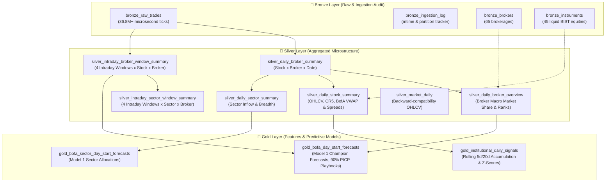

# MDK Medallion Lakehouse Pipeline Skill

This skill provides comprehensive architectural reference and operational procedures for running, modifying, and debugging the **Medallion Lakehouse Pipeline** (`src/mdk_trading_oracle/data/`).

---

## 🤝 1. Collaborative Interaction & Pipeline Workflows

When adding new tables, transforming features, or integrating new Gold models:
1. **Plan Together First**: Discuss table schemas, microstructural metrics, and modeling hypotheses.
2. **Review & Confirm**: Align on column names, data leakage guarantees ($T-1$ Close / prior window bounds), and verification tests.
3. **Execute ("Let's Go!")**: Implement changes cleanly across Bronze, Silver, and Gold layers with complete test coverage (`pytest`), linting (`ruff`), and interactive notebook verification.

---

## 🏛 2. Lakehouse Architecture & Table Reference

A high-performance local-first lakehouse powered by **DuckDB + Polars + Python 3.9**:



### A. Bronze Layer (`src/mdk_trading_oracle/data/bronze/`)
- **`bronze_raw_trades`**: Raw microsecond tick executions (`trade_id`, `timestamp`, `symbol`, `price`, `volume`, `buyer_broker_id`, `seller_broker_id`, `raw_source`, `ingested_at`).
- **`bronze_ingestion_log`**: Primary key `file_path`. Tracks file size, mtime epoch, `trade_date`, `year_month`, and row counts to enable fast incremental updates.
- **`bronze_brokers`**: Dimension reference table (`broker_id`, `broker_name`, `category`, `is_primary_target`, `description`) synchronized from `config/brokers.yaml`.
- **`bronze_instruments`**: Dimension reference table (`symbol`, `name`, `sector`, `index_name`, `lot_multiplier`) synchronized from `config/instruments.yaml`.

### B. Silver Layer (`src/mdk_trading_oracle/data/silver/`)
- **`silver_daily_broker_summary`**: Primary key `(trade_date, symbol, broker_id)`. Aggregates buy/sell volume, turnover (TL), buy/sell/total VWAP, trade counts, net volume, net flow (TL), and broker-stock turnover share.
- **`silver_daily_broker_overview`**: Primary key `(trade_date, broker_id)`. Macro broker statistics including market turnover share, market volume share, turnover rank, net flow rank, `is_top_5_broker`, top bought/sold symbols, top sector name, and top sector share.
- **`silver_daily_stock_summary`**: Primary key `(trade_date, symbol)`. Stock OHLCV, market VWAP, daily return %, price range %, total trades, CR5 concentration ratio, top buyer/seller broker IDs + turnover + share, top-5 domestic net flow, BofA buy/sell turnover, BofA net flow, BofA stock turnover share, BofA VWAP spread %, and BofA rank in stock.
- **`silver_daily_sector_summary`**: Primary key `(trade_date, sector, broker_id)`. Daily sector breadth, buy/sell turnover, net flow (TL), active symbol count, and sector turnover share.
- **`silver_intraday_broker_window_summary`**: Primary key `(trade_date, symbol, broker_id, window_name)`. Aggregates executions across 4 canonical intraday windows:
  - `Window 1: Opening Auction & Initial Flow` (09:55 – 10:30)
  - `Window 2: Midday Discovery & Base Building` (10:30 – 13:00)
  - `Window 3: Afternoon Liquidity & US Open Pre-Align` (13:00 – 17:00)
  - `Window 4: Closing Ramp & MOC / Final VWAP` (17:00 – 18:10)
- **`silver_intraday_sector_window_summary`**: Primary key `(trade_date, sector, broker_id, window_name)`. Intraday sector rotation and broker execution across the 4 windows.
- **`silver_market_daily`**: Primary key `(trade_date, symbol)`. Backward-compatibility daily summary table.

### C. Gold Layer (`src/mdk_trading_oracle/data/gold/`, `src/mdk_trading_oracle/models/`)
- **`gold_institutional_daily_signals`**: Primary key `(trade_date, symbol)`. Rolling 5-day / 20-day cumulative BofA flow (`bofa_accum_5d_tl`, `bofa_accum_20d_tl`), volume shares, and 20-day rolling Z-score (`bofa_flow_zscore_20d`).
- **`gold_bofa_day_start_forecasts`**: Primary key `forecast_date`. Populated by Model 1 `DayStartForecaster(model_type="auto")`. Contains predicted opening net flow, 90% credible intervals (`predicted_open_flow_lower_90`, `predicted_open_flow_upper_90`), directional conviction (`predicted_direction`, `direction_confidence`), predicted opening market share, institutional playbooks (`predicted_playbook`), top predicted buy/sell sectors, and champion model metadata.
- **`gold_bofa_sector_day_start_forecasts`**: Primary key `(forecast_date, sector)`. Sector-level opening flow allocation forecasts with predicted direction and confidence.

---

## ⚡ 3. Pipeline Execution & Command Matrix

The pipeline is fully automated with dependency DAG resolution (e.g. running `gold` automatically builds `bronze` and `silver` if needed).

### A. Python Script Runner (`scripts/run_pipeline.py`)

```bash
# 1. Full Incremental Pipeline (ingests only new/modified CSVs, executes Silver & Gold)
.venv/bin/python scripts/run_pipeline.py --target all

# 2. Pipeline with Catalog Auto-Sync (discovers new tickers/brokers & syncs YAMLs first)
.venv/bin/python scripts/run_pipeline.py --target all --sync-catalog

# 3. Selective Single-Date Re-ingestion (atomically replaces single trading day)
.venv/bin/python scripts/run_pipeline.py --target all --date 2026-03-09

# 4. Selective Month Re-ingestion (atomically replaces single monthly partition)
.venv/bin/python scripts/run_pipeline.py --target all --month 2026-03

# 5. Full Force Rebuild (clears tables and re-ingests everything from scratch)
.venv/bin/python scripts/run_pipeline.py --target all --force

# 6. Target Specific Layer
.venv/bin/python scripts/run_pipeline.py --target bronze
.venv/bin/python scripts/run_pipeline.py --target silver
.venv/bin/python scripts/run_pipeline.py --target gold
.venv/bin/python scripts/run_pipeline.py --target catalog

# 7. Disable DAG Dependency Resolution (execute isolated layer)
.venv/bin/python scripts/run_pipeline.py --target silver --no-deps
```

### B. Typer CLI (`mdk-oracle`)

```bash
# Display system environment, directory mappings, and live table counts
.venv/bin/mdk-oracle info

# Raw data discovery & YAML catalog inspection
.venv/bin/mdk-oracle data inspect
.venv/bin/mdk-oracle data sync-catalog

# Layer-by-layer executions
.venv/bin/mdk-oracle load-bronze
.venv/bin/mdk-oracle build-silver
.venv/bin/mdk-oracle build-gold
.venv/bin/mdk-oracle build-all --sync-catalog

# Pipeline group runner with DAG resolution
.venv/bin/mdk-oracle pipeline run --target all --sync-catalog
```

---

## 📊 4. Medallion Table Inventory & Verification Matrix

Baseline dataset statistics (March 2026 / 21 trading days / 45 liquid BIST equities):

| Layer | Table Name | Granularity / Primary Key | March 2026 Rows | Status |
| :--- | :--- | :--- | :---: | :---: |
| **Bronze** | `bronze_raw_trades` | Tick execution (`trade_id`, `timestamp`) | 36,818,222 | ✅ Verified |
| **Bronze** | `bronze_ingestion_log` | `file_path` | 947 | ✅ Verified |
| **Bronze** | `bronze_brokers` | `broker_id` | 65 | ✅ Verified |
| **Bronze** | `bronze_instruments` | `symbol` | 45 | ✅ Verified |
| **Silver** | `silver_daily_broker_summary` | `(trade_date, symbol, broker_id)` | 48,058 | ✅ Verified |
| **Silver** | `silver_daily_broker_overview` | `(trade_date, broker_id)` | 1,235 | ✅ Verified |
| **Silver** | `silver_daily_stock_summary` | `(trade_date, symbol)` | 945 | ✅ Verified |
| **Silver** | `silver_daily_sector_summary` | `(trade_date, sector, broker_id)` | 28,516 | ✅ Verified |
| **Silver** | `silver_intraday_broker_window_summary` | `(trade_date, symbol, broker_id, window_name)` | 166,095 | ✅ Verified |
| **Silver** | `silver_intraday_sector_window_summary` | `(trade_date, sector, broker_id, window_name)` | 99,825 | ✅ Verified |
| **Silver** | `silver_market_daily` | `(trade_date, symbol)` | 945 | ✅ Verified |
| **Gold** | `gold_institutional_daily_signals` | `(trade_date, symbol)` | 945 | ✅ Verified |
| **Gold** | `gold_bofa_day_start_forecasts` | `forecast_date` | 20 | ✅ Verified |
| **Gold** | `gold_bofa_sector_day_start_forecasts` | `(forecast_date, sector)` | Extensible | ✅ Verified |

---

## 📓 5. Interactive Research & Audit Notebooks

The pipeline is tightly integrated with interactive Jupyter notebooks located in `notebooks/`:

| Notebook | Topic & Scope | Key Capabilities |
| :--- | :--- | :--- |
| [`00_data_discovery_and_catalog_analysis.ipynb`](file:///Users/ozkanyildirim/.gemini/antigravity-ide/scratch/mdk-trading-oracle/notebooks/00_data_discovery_and_catalog_analysis.ipynb) | Raw Data Discovery & Catalog Audit | Scan raw partitions, inspect entity distributions, and verify zero-loss data completeness. |
| [`01_bronze_data_exploration.ipynb`](file:///Users/ozkanyildirim/.gemini/antigravity-ide/scratch/mdk-trading-oracle/notebooks/01_bronze_data_exploration.ipynb) | Microsecond Tick Microstructure | Microsecond trade timestamp analysis, VWAP price curves, broker execution feeds. |
| [`02_silver_transformations_and_intraday_analysis.ipynb`](file:///Users/ozkanyildirim/.gemini/antigravity-ide/scratch/mdk-trading-oracle/notebooks/02_silver_transformations_and_intraday_analysis.ipynb) | Silver Layer & 4-Window Intraday | Broker market shares, BofA VWAP spreads, CR5 concentration, and 4-window execution profiles. |
| [`03_bofa_day_start_modeling.ipynb`](file:///Users/ozkanyildirim/.gemini/antigravity-ide/scratch/mdk-trading-oracle/notebooks/03_bofa_day_start_modeling.ipynb) | Model 1 Day-Start Arena & Playbooks | 7 Feature Clusters extraction, walk-forward arena tournament, Bayesian Ridge / PyMC / LightGBM, and actionable trader playbooks. |

*Kernel requirement*: Always select **`Python 3.9 (mdk-trading-oracle)`**.

---

## 🔒 6. Concurrency, Storage Portability & Lock Troubleshooting

### DuckDB File Lock Protocol (CRITICAL)
DuckDB enforces exclusive single-process write locks.
- **Pipelines & Ingestors**: Use write mode via `DuckDBManager()`.
- **Notebooks & Analytical Queries**: **MUST** use `read_only=True`:
  ```python
  from mdk_trading_oracle.core.db import DuckDBManager
  db = DuckDBManager(read_only=True)
  # Or directly via DuckDB:
  import duckdb
  conn = duckdb.connect(str(settings.database_path), read_only=True)
  ```

### Resolving Lock Conflicts
If `DuckDB lock conflict: ... is currently locked by another process` occurs:
1. Identify the holding process:
   ```bash
   ps aux | grep -E "python|jupyter|duckdb"
   ```
2. Terminate the blocking process:
   ```bash
   kill <PID>
   ```

### Storage Portability
Never hardcode absolute user-specific paths (`/Users/...`). Always use:
- `get_settings().data_dir`
- `Path.home() / "data" / "mdk_oracle"`

---

## 🧪 7. Automated Testing & Quality Assurance

Verify pipeline integrity after any modifications:

```bash
# Run complete test suite (unit + integration + model arena tests)
.venv/bin/pytest tests/ -v

# Run linting and code style checks
.venv/bin/ruff check .
```
