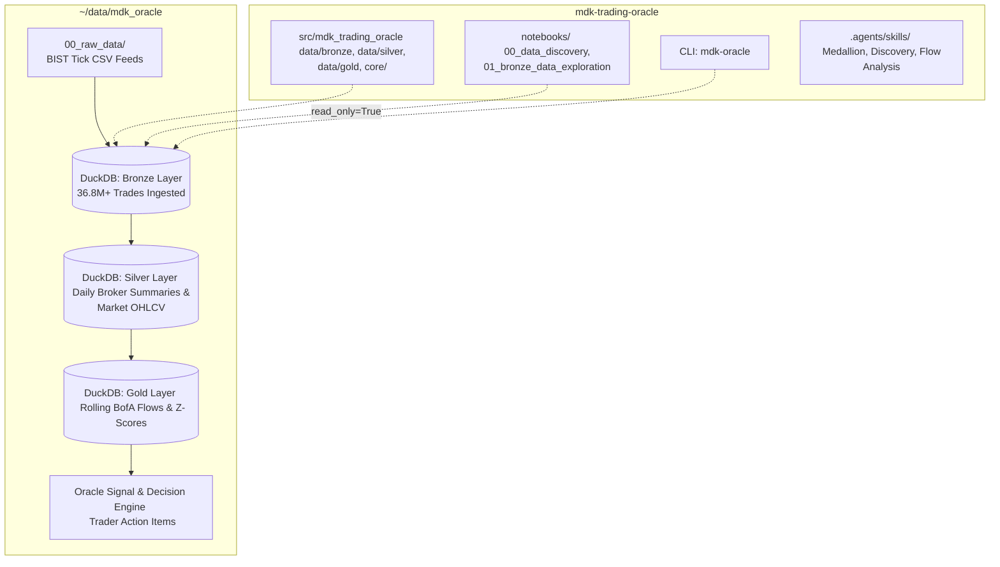

# 🏛 MDK Trading Oracle

A local-first, high-throughput quantitative trading decision support engine and institutional order flow analyzer for **Borsa Istanbul (BIST)**, with specialized intelligence on **Bank of America (BofA / clearing code `MLB`)**.

### 🎯 Mission & Core Objective
Track and quantify institutional footprints from market-moving participants—primarily **Bank of America (BofA)**—to detect accumulation, distribution, aggressive block flows, and algorithmic momentum, translating these patterns into **concrete, high-probability action items and trading signals for individual traders**.

---

## 🏗 Architecture Overview

`mdk-trading-oracle` enforces a strict **separation of code and physical data** while implementing a high-throughput **Medallion Data Lakehouse Architecture** powered by **DuckDB, Polars, and Parquet**:



### Medallion Lakehouse Layers

1. **Bronze Layer (`bronze_*`)**:
   - `bronze_raw_trades`: 36,818,222 raw microsecond tick executions.
   - `bronze_central_bank_rates`: 1,157 daily Central Bank (TCMB) 1-week repo policy interest rate observations (2022–2026).
   - `bronze_ingestion_log`: File metadata, mtime, and partition audit tracking.
   - `bronze_brokers`: 65 brokerage entity definitions.
   - `bronze_instruments`: 45 tracked liquid BIST equities.
2. **Silver Layer (`silver_*`)**:
   - `silver_daily_broker_summary`: 48,058 daily stock $\times$ broker turnaround and VWAP records.
   - `silver_daily_broker_overview`: 1,235 daily macro broker market share and liquidity rankings.
   - `silver_daily_stock_summary`: 945 daily stock OHLCV, market VWAP, CR5 concentration, and BofA spreads.
   - `silver_daily_sector_summary`: 28,516 sector breadth and turnaround metrics.
   - `silver_daily_macro_rates`: 1,157 daily macroeconomic policy rate records with rate deltas, decision flags, days since last MPC change, and 30-day rolling means.
   - `silver_intraday_broker_window_summary`: 166,095 executions split across 4 canonical intraday windows (Window 1 Day-Start 09:55–10:30, Window 2 Midday, Window 3 Afternoon, Window 4 Closing 17:00–18:10).
   - `silver_intraday_sector_window_summary`: 99,825 sector-level intraday window executions.
3. **Gold Layer (`gold_*`) & Predictive Multi-Model Suite**:
   - `gold_institutional_daily_signals`: Rolling 5-day / 20-day institutional accumulation metrics and BofA flow Z-scores.
   - `gold_bofa_day_start_forecasts`: **Model 1: Macro Day-Start Forecaster** — active live predictions strictly for upcoming session $T+1$ (exchange-wide opening flow, 90% credible intervals, directional conviction, and institutional execution playbooks).
   - `gold_bofa_sector_day_start_forecasts`: **Model 2: Sector Day-Start Forecaster** — active live sector opening allocation predictions strictly for upcoming session $T+1$ across 26 tracked BIST sectors.
   - `gold_bofa_day_start_performance` & `gold_bofa_sector_day_start_performance`: **Permanent Audited Performance Ledgers** — historical records reconciling past predictions against actual realized Window 1 market data (MAE, RMSE, direction hit %, and 90% coverage).
   - `gold_bofa_day_start_backtests` & `gold_bofa_sector_day_start_backtests`: Dedicated historical walk-forward simulation ledgers for calibration and tournament benchmarking.

---

## 🔬 Predictive Modeling Blueprint & Trailing Walk-Forward Arena

All Gold layer predictive models adhere to the Universal Modeling Blueprint:
- **Zero Lookahead Bias & Retrospective Anchoring**: Features are computed strictly from $T-1$ Close data (18:10 TRT). When running retrospective backfills for missed past days, the training window dynamically and strictly anchors backwards 12 months from the target session.
- **Candidate Model Suites**: Benchmarking 5 candidate paradigms:
  1. `NaivePersistenceModel` (prior W4 flow)
  2. `RollingMeanModel` (5-day rolling average)
  3. `LightGBMModel` (non-linear boosted tree ensemble)
  4. `BayesianModel` (Bayesian Ridge with analytical 90% credible intervals)
  5. `PyMCModel` (Bayesian GLM with shrinkage priors)
- **Three-Table Persistence Architecture**: Strict separation between pure live $T+1$ inference (`gold_bofa_*_forecasts`), audited performance tracking (`gold_bofa_*_performance`), and simulation backtests (`gold_bofa_*_backtests`).
- **Point-in-Time Historical Backfilling**: Seamlessly backfill missed sessions point-in-time (`--backfill-missing` or `--backfill-dates`) with zero lookahead leakage, upserting into the performance ledger.

---

## 🔒 Strict Separation of Code & Data

To support zero-cost execution and portability across different team members:
- **Code Repository (`mdk-trading-oracle`)**: Contains Python source code, schemas, ETL scripts, unit tests, notebooks, and `.agents/skills/`. No heavy data binaries are tracked in Git.
- **Physical Data Store (`DATA_DIR`)**: Stored outside the repository (default: `~/data/mdk_oracle/` or configured in `.env`).

```
~/data/mdk_oracle/
├── 00_raw_data/              # Raw data landing zone (CSV feeds & macro data)
│   ├── 2026/03_march/
│   │   └── raw_csv/          # 21 trading days of raw tick feeds (945 files)
│   └── central_bank_interest_rates/ # CBRT 1-week repo rate history (.xlsx / .csv)
└── database/
    └── mdk_oracle.duckdb     # Fast local DuckDB database (36.8M+ trades)
```

---

## 🚀 Quickstart

### 1. Installation & Environment

```bash
git clone git@github.com:ozy-mdk/mdk-trade-oracle.git
cd mdk-trade-oracle

python3 -m venv .venv
source .venv/bin/activate

pip install -e ".[dev]"
```

### 2. Run Lakehouse Pipeline

```bash
# Execute full incremental pipeline (Bronze -> Silver -> Gold):
.venv/bin/python scripts/run_pipeline.py --target all

# Ingest and forward-fill Central Bank interest rates:
.venv/bin/mdk-oracle load-rates

# Or run with data catalog auto-discovery:
.venv/bin/python scripts/run_pipeline.py --target all --sync-catalog
```

---

## 📊 Interactive Research Notebooks

Launch Jupyter to explore institutional flows and test models interactively:

```bash
jupyter lab
```

Available notebooks in [`notebooks/`](notebooks/):
1. **`00_data_discovery_and_catalog_analysis.ipynb`**: Raw CSV tick and Central Bank rate inspection, YAML catalog validation, and zero-loss coverage audits.
2. **`01_bronze_data_exploration.ipynb`**: High-performance tick trade analytics, broker liquidity distributions, and execution spreads.
3. **`02_silver_flow_and_vwap_analysis.ipynb`**: Daily broker turnarounds, stock CR5 concentration, and 4-window intraday execution splits.
4. **`03_bofa_day_start_modeling.ipynb`**: Model 1 Macro Day-Start Forecaster, candidate arena scoreboard, 90% credible intervals, and institutional playbooks.
5. **`04_bofa_sector_day_start_modeling.ipynb`**: Model 2 Sector Day-Start Forecaster, cross-sectional sector allocation heatmaps, and rotation visualizers.

---

## 🧪 Testing & Code Quality

Run tests using `pytest`:
```bash
.venv/bin/pytest
```

Run code formatting and linting:
```bash
.venv/bin/ruff check .
```

---

## ⚡ Key Principles

- **Zero Compute Cost**: Vectorized analytics execute directly on local hardware using DuckDB & Polars.
- **Strict Data Isolation**: No raw exchange data stored inside source control.
- **Concurrent Access**: Robust read-only DuckDB connections (`DuckDBManager(read_only=True)`) prevent file lock contention across multiple notebook kernels and terminal processes.
