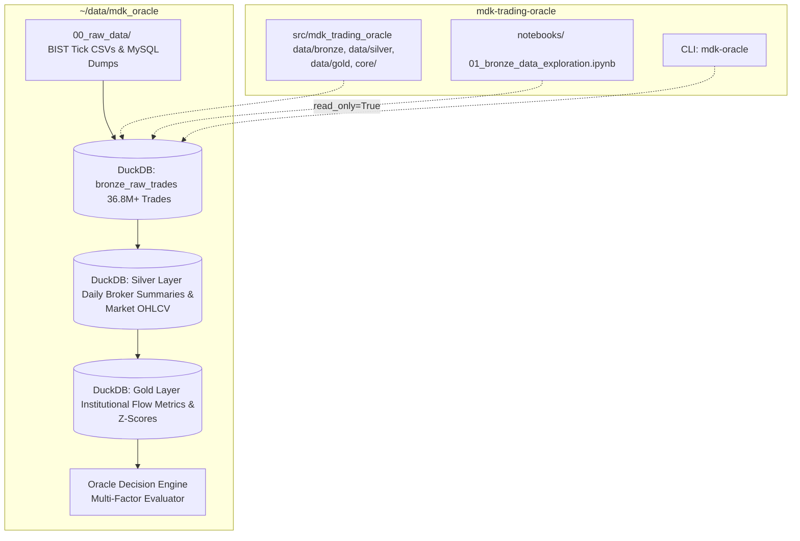

# 🏛 MDK Trading Oracle

A local-first, zero-cost quantitative trading decision support engine and institutional order flow analyzer, with specialized intelligence on **Bank of America (`MLB` / Merrill Lynch)** institutional flow across the **Turkish Equity Market (Borsa Istanbul / BIST)**.

---

## 🏗 Architecture Overview

`mdk-trading-oracle` enforces a strict **separation of code and physical data** while implementing a high-throughput **Medallion Data Lakehouse Architecture** powered by **DuckDB, Polars, and Parquet**:



### Medallion Lakehouse Layers

1. **Bronze Layer (`bronze_*`)**:
   - `bronze_raw_trades`: 36,818,222 raw tick-by-tick trades across all 21 trading days in March 2026.
   - `bronze_brokers`: 18 institutional and domestic brokerage definitions.
   - `bronze_instruments`: BIST universe symbols (e.g. `THYAO`, `AKBNK`, `GARAN`, `EREGL`, `TUPRS`, `BIMAS`).
2. **Silver Layer (`silver_*`)**:
   - `silver_daily_broker_summary`: 48,058 aggregated daily records containing buy/sell volumes, turnover, and buy/sell VWAP per `(trade_date, symbol, broker_id)`.
   - `silver_market_daily`: 945 daily OHLCV, market turnover, active broker counts, and Bank of America volume share metrics.
3. **Gold Layer (`gold_*`)**:
   - `gold_institutional_daily_signals`: Rolling 5-day and 20-day institutional accumulation metrics, BofA Z-scores, and flow signals.
4. **Oracle Decision Engine (`oracle/`)** *(Planned)*:
   - Multi-factor quantitative evaluator producing confidence scores, actionable signals (`BUY` / `SELL` / `HOLD`), and narrative logs.

---

## 🔒 Strict Separation of Code & Data

To support local zero-cost execution today and seamless migration to cloud blob storage (e.g., S3 / GCS) in the future:
- **Code Repository (`mdk-trading-oracle`)**: Contains only Python source code, schemas, ETL scripts, unit tests, and notebooks. No heavy data binaries or raw CSVs are tracked in Git.
- **Physical Data Store (`DATA_DIR`)**: Stored outside the repository (default: `~/data/mdk_oracle/` or configured in `.env`).

```
/Users/ozkanyildirim/data/mdk_oracle/
├── 00_raw_data/              # Raw data landing zone (CSVs & SQL dumps)
│   └── 2026/03_march/
│       ├── dump/             # MySQL raw dumps
│       └── raw_csv/          # 21 trading days of raw tick feeds
└── database/
    └── mdk_oracle.duckdb     # Fast local DuckDB database (36.8M+ trades)
```

---

## 🚀 Quickstart

### 1. Installation

Clone the repository and set up a Python 3.9+ virtual environment:

```bash
git clone git@github.com:ozy-mdk/mdk-trade-oracle.git
cd mdk-trade-oracle

python3 -m venv .venv
source .venv/bin/activate  # On Windows: .venv\Scripts\activate

pip install -e ".[dev]"
```

### 2. Configure Environment

Copy the example environment configuration:
```bash
cp .env.example .env
```

The default configuration in `.env`:
```env
APP_ENV=development
LOG_LEVEL=INFO
DEFAULT_MARKET=BIST
PRIMARY_INSTITUTION=MLB
DATA_DIR=/Users/ozkanyildirim/data/mdk_oracle
```

### 3. Check System Status & Ingestion

Verify your database status using the CLI:
```bash
mdk-oracle info
```

### 4. Build Lakehouse Layers

Run the Medallion pipeline layers individually or end-to-end:
```bash
# Ingest Bronze layer (36.8M+ ticks in ~4s):
mdk-oracle load-bronze

# Build Silver layer (daily broker summaries & OHLCV in ~9s):
mdk-oracle build-silver

# Build Gold layer (institutional indicators & Z-scores in ~0.2s):
mdk-oracle build-gold

# Or run the entire pipeline end-to-end:
mdk-oracle build-all
```

---

## 📊 Interactive Exploration Notebooks

Launch Jupyter Lab to explore the data interactively:

```bash
jupyter lab
```

Open [`notebooks/01_bronze_data_exploration.ipynb`](notebooks/01_bronze_data_exploration.ipynb):
- **Concurrency-Safe**: Connects to DuckDB with `read_only=True` to allow concurrent queries without locking issues.
- **Analysis Included**:
  - Daily market turnover and trading activity across March 2026.
  - Top traded instruments and price ranges.
  - Broker market share and net flows (focusing on Bank of America / `MLB`).
  - Intraday trade arrival distributions (10:00 - 18:00 session).
  - Interactive dark-theme Plotly charts.

---

## 📂 Project Structure

```
mdk-trading-oracle/
├── config/                               # YAML schemas & broker configurations
│   ├── brokers.yaml                      # Broker definitions (MLB, YKBNK, ISCTR, etc.)
│   ├── default.yaml                      # Feature and pipeline parameters
│   └── instruments.yaml                  # BIST equity symbols & sector mappings
├── notebooks/                            # Exploratory analysis & transformation design
│   └── 01_bronze_data_exploration.ipynb  # Interactive Bronze layer EDA
├── scripts/                              # Standalone automation scripts
│   └── load_bronze_data.py               # Fast Bronze CSV ingestion runner
├── src/mdk_trading_oracle/               # Core Python package
│   ├── app/                              # Typer CLI application
│   │   ├── __init__.py
│   │   └── cli.py                        # CLI commands (info, load-bronze, build-silver, build-gold)
│   ├── core/                             # Foundational engine modules
│   │   ├── config.py                     # Dynamic settings & paths
│   │   ├── db.py                         # DuckDB connection & schema manager
│   │   ├── logger.py                     # Rich formatted logger
│   │   └── types.py                      # Pydantic domain models & enums
│   └── data/                             # Medallion Lakehouse Data Management
│       ├── bronze/                       # Bronze layer DDL & raw ingestors
│       │   ├── schema.py
│       │   └── ingestor.py
│       ├── silver/                       # Silver layer transformations (VWAP, OHLCV, Broker summaries)
│       │   ├── schema.py
│       │   └── transformations.py
│       └── gold/                         # Gold layer features (BofA flow indicators, Z-scores)
│           ├── schema.py
│           └── feature_engineering.py
├── tests/                                # Automated test suite
│   ├── test_core.py                      # Config, DB, and domain unit tests
│   └── test_medallion.py                 # End-to-end Medallion pipeline tests
├── .env.example                          # Environment variables template
├── .gitignore                            # Git ignore rules
├── pyproject.toml                        # Project dependencies, ruff & pytest configs
└── README.md                             # Project documentation
```

---

## 🧪 Testing & Code Quality

Run tests using `pytest`:
```bash
pytest
```

Run code formatting and linting:
```bash
ruff check .
```

---

## ⚡ Key Principles

- **Zero Compute Cost**: Vectorized analytics execute directly on local hardware using DuckDB & Polars.
- **Strict Data Isolation**: No customer or raw exchange data inside source control.
- **Concurrent Access**: Robust read-only DuckDB connections prevent file lock contention across multiple notebook kernels and terminal processes.
