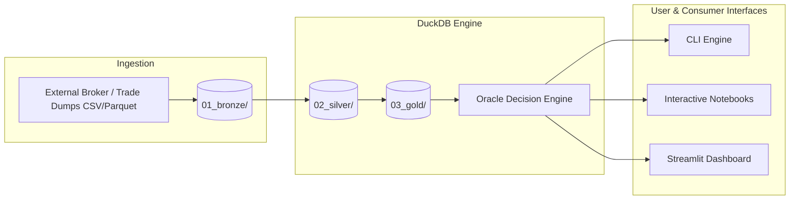

# MDK Trading Oracle

A local-first, zero-cost quantitative trading decision support engine and institutional flow analyzer, with a specialized focus on **Bank of America (BofA)** institutional order flow in the **Turkish Equity Market (Borsa Istanbul / BIST)**.

---

## 🏛 Architecture Overview

`mdk-trading-oracle` implements a **Medallion Data Lakehouse Architecture** running entirely locally via **DuckDB + Parquet**:



### Medallion Layers
1. **Bronze (`01_bronze/`)**: Raw immutable files directly ingested from data vendors or broker exports.
2. **Silver (`02_silver/`)**: Cleaned, schema-validated, normalized trades and daily broker summaries (`silver_broker_transactions`, `silver_daily_broker_summary`).
3. **Gold (`03_gold/`)**: Engineered features, rolling BofA accumulation/distribution metrics, volume shares, flow momentum, and acceleration (`gold_bofa_flow_metrics`, `gold_model_inputs`).
4. **Oracle (`oracle/`)**: Multi-rule evaluator and ML model signals outputting confidence scores, action levels (`BUY` / `SELL` / `HOLD`), and human-readable reasoning logs.

---

## 🚀 Quickstart

### 1. Installation

Clone the repository and set up a virtual environment:

```bash
cd mdk-trading-oracle
python -m venv .venv
source .venv/bin/activate  # On Windows: .venv\Scripts\activate

pip install -e ".[dev]"
```

### 2. Configure Environment

Copy `.env.example` to `.env`:
```bash
cp .env.example .env
```

### 3. Generate Mock Data & Run Pipeline

Seed realistic BIST 30 trades (including simulated BofA flow):
```bash
python scripts/seed_mock_data.py
```

Run the complete Bronze $\rightarrow$ Silver $\rightarrow$ Gold $\rightarrow$ Oracle pipeline via CLI:
```bash
mdk-oracle run-pipeline
```

Evaluate institutional signals for a symbol (e.g. `AKBNK`, `GARAN`):
```bash
mdk-oracle evaluate --symbol AKBNK
```

---

## 📂 Project Structure

```
mdk-trading-oracle/
├── config/                     # YAML configs for market, brokers & instruments
│   ├── default.yaml            # Pipeline & storage settings
│   ├── brokers.yaml            # Broker definitions (BOFA, YKBNK, ISCTR, etc.)
│   └── instruments.yaml        # BIST 30 universe and classification
├── data/                       # Local data storage (strictly gitignored)
│   ├── 01_bronze/              # Raw data drops
│   ├── 02_silver/              # Cleaned parquet tables
│   ├── 03_gold/                # Aggregated feature tables
│   └── database/               # Local DuckDB database file
├── notebooks/                  # Interactive Databricks-style Jupyter notebooks
│   └── 01_bofa_flow_eda.ipynb  # BofA order flow EDA & signal visualizer
├── scripts/                    # Helper and automation scripts
│   ├── seed_mock_data.py       # Realistic synthetic data generator
│   └── run_pipeline.py         # Standalone pipeline runner
├── src/mdk_trading_oracle/     # Core Python package
│   ├── app/                    # Typer CLI application
│   ├── core/                   # DuckDB manager, types, and configs
│   ├── features/               # Institutional flow feature extractors
│   ├── ingestion/              # Ingestion handlers
│   ├── models/                 # Flow prediction ML / LightGBM models
│   ├── oracle/                 # Decision evaluation engine
│   └── pipeline/               # Bronze -> Silver -> Gold transformation pipelines
├── tests/                      # Pytest automated test suite
├── .env.example                # Environment variables template
├── .gitignore                  # Gitignore rules
└── pyproject.toml              # Modern package dependencies and metadata
```

---

## 💡 Databricks-style Notebook Workflow

Launch Jupyter to explore DuckDB tables interactively:
```bash
jupyter lab
```
Open `notebooks/01_bofa_flow_eda.ipynb` to view:
- Direct DuckDB SQL queries over local Parquet.
- BofA net cumulative flow charts vs stock price trends.
- Real-time Oracle signal summaries.

---

## 🔒 Portability & Zero-Cost Principles
- **No cloud compute bills**: Everything is optimized to run locally via DuckDB vectorization.
- **Dynamic paths**: All paths dynamically resolve relative to the project root or `.env`. No hardcoded user directories.
- **Git-safe**: Raw financial trade data and local DuckDB files are excluded from Git commits.
