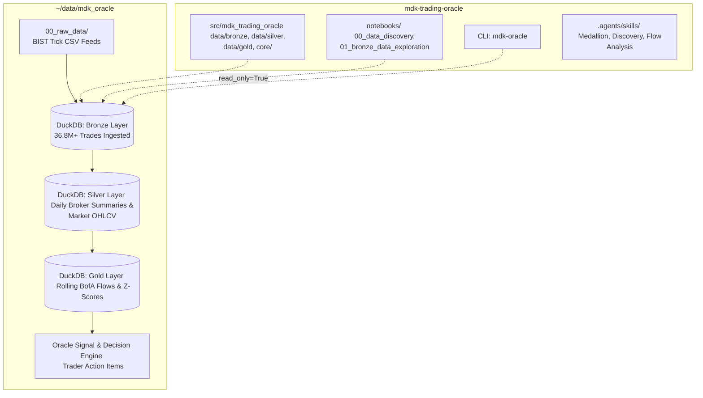

# 🏛 MDK Trading Oracle

A local-first, high-throughput quantitative trading decision support engine and institutional order flow analyzer for **Borsa Istanbul (BIST)**, with specialized intelligence on **Bank of America (BofA / clearing code `MLB`)**.

### 🎯 Mission & Core Objective
Track and quantify institutional footprints from market-moving participants—primarily **Bank of America (BofA)**—to detect accumulation, distribution, aggressive block flows, and algorithmic momentum, translating these patterns into **concrete, high-probability action items and trading signals for individual traders**.

---

## 🏗 Architecture Overview

`mdk-trading-oracle` enforces a strict **separation of code and physical data** while implementing a high-throughput **Medallion Data Lakehouse Architecture** powered by **DuckDB, Polars, and Parquet**:


```mermaid
flowchart TD
    subgraph External Data Lakehouse [~/data/mdk_oracle]
        A[00_raw_data/ <br> BIST Tick CSV Feeds] --> B[(DuckDB: Bronze Layer <br> 36.8M+ Trades Ingested)]
        B --> C[(DuckDB: Silver Layer <br> Daily Broker Summaries & Market OHLCV)]
        C --> D[(DuckDB: Gold Layer <br> Rolling BofA Flows & Z-Scores)]
        D --> E[Oracle Signal & Decision Engine <br> Trader Action Items]
    end

    subgraph Code Repository [mdk-trading-oracle]
        F[src/mdk_trading_oracle <br> data/bronze, data/silver, data/gold, core/]
        G[notebooks/ <br> 00_data_discovery, 01_bronze_data_exploration]
        H[CLI: mdk-oracle]
        I[.agents/skills/ <br> Medallion, Discovery, Flow Analysis]
    end

    F -.-> B
    G -.->|read_only=True| B
    H -.-> B
```

### Medallion Lakehouse Layers

1. **Bronze Layer (`bronze_*`)**:
   - `bronze_raw_trades`: 36,818,222 raw microsecond tick executions.
   - `bronze_central_bank_rates`: 1,157 daily Central Bank (TCMB) 1-week repo policy interest rate observations (2022–2026).
   - `bronze_ingestion_log`: File metadata, mtime, and partition audit tracking.
   - `bronze_brokers`: 65 brokerage entity definitions.
   - `bronze_instruments`: 45 tracked liquid BIST equities.
2. **Silver Layer (`silver_*`)**:
   - `silver_daily_broker_summary`: 48,058 daily stock $\times$ broker turnaround and VWAP records.
   - `silver_daily_broker_overview`: 1,235 daily macro broker market share and liquidity rankings.
   - `silver_daily_stock_summary`: 945 daily stock OHLCV, market VWAP, CR5 concentration, and BofA spreads.
   - `silver_daily_sector_summary`: 28,516 sector breadth and turnaround metrics.
   - `silver_daily_macro_rates`: 1,157 daily macroeconomic policy rate records with rate deltas, decision flags, days since last MPC hike/cut, rate spreads vs 30-day mean, and daily carry cost bps.
   - `silver_daily_benchmark_index`: 1,248 daily official BIST 30 benchmark metrics with rolling 5d/20d returns, 20d volatility, and 20d SMA spreads.
   - `silver_bofa_historical_flow_thresholds`: 27 empirical flow percentile profiles (1 Macro ALL + 26 BIST sectors) computing continuous $P_{25}, P_{50}, P_{85}$ quantiles across historical buy and sell actions.
   - `silver_broker_fifo_daily`: 48,058 daily records tracking intraday matching, residual flow, carry FIFO realized PnL, open stock quantities, and MTM valuations across key desks (`MLB`, `IYM`, `YKR`, `AKM`, `GRM`, `ZRY`, `TRA`).
   - `silver_broker_fifo_lot_entries`: 29,613 immutable FIFO lot entry records.
   - `silver_broker_fifo_lots`: 13,543 currently active open FIFO lots.
   - `silver_broker_fifo_lot_realizations`: 33,610 audited partial/full closure events.
   - `silver_broker_fifo_lot_lifecycle`: 29,613 consolidated lot lifecycle summaries.
   - `silver_intraday_broker_window_summary`: 209,500 executions split across 5 canonical intraday windows in Turkish Time (Window 1 Day-Start 09:55–10:30, Window 2 First Reaction 10:30–11:30, Window 3 Midday 11:30–14:30, Window 4 Afternoon 14:30–16:00, Window 5 Closing 16:00–18:15).
   - `silver_intraday_sector_window_summary`: 126,300 sector-level intraday window executions.
   - 📖 *See [docs/TERTIP_FIFO_MECHANISM.md](docs/TERTIP_FIFO_MECHANISM.md) for full technical documentation and formulas.*

3. **Gold Layer (`gold_*`) & Institutional Predictive Intelligence**:
   - `gold_institutional_daily_signals`: Rolling 5-day / 20-day institutional accumulation metrics and BofA flow Z-scores.
   - **Institutional Tertip ML Forecaster (`TertipMLForecaster`)**: Live predictive engine powered by 17 lean microstructure features, point-in-time FIFO inventory, intraday matched volume, carry FIFO PnL, carry costs, macro rates, and benchmark index momentum.
   - **Walk-Forward Tournament Arena**: Dynamic candidate model tournament benchmarking LightGBM, Bayesian Ridge, and Moving Average baselines on the fly, with champion selection crowned primarily by **Directional Hit Rate %** (with MAE tie-breaker).
   - **Trader Workstation Integration**: Real-time signal cards for upcoming session $T+1$ with forecasted flow, credible ranges, directional conviction badges, and institutional execution playbooks (`SQUEEZE_LONG`, `MOMENTUM_EXPANSION`, `LIQUIDITY_FADE`, `DEFENSE_SUPPORT`).

---

## 🔬 Predictive Modeling Blueprint & Trailing Walk-Forward Arena

The predictive architecture is centered around the **Tertip Machine Learning Forecaster**:
- **Zero Lookahead Bias & Strict Trailing Lookback**: Features are computed strictly from $T-1$ Close data (18:10 TRT). The training lookback dynamically and strictly anchors backwards 12 months from the evaluation date.
- **17 Lean Microstructure Features**: High-alpha features focused on carried FIFO inventory, unrealized MTM PnL, carry FIFO realized PnL, intraday scalping PnL, Central Bank repo rates, daily carry costs, and BIST 30 benchmark momentum.
- **Directional Champion Selection**: Prioritizes directional win rate (predicting whether institutional flow is positive or negative) with Mean Absolute Error (MAE) as the secondary tie-breaker.
- **Interactive Workstation Serving**: Directly integrated into the React frontend's dedicated Gold Predictive Hub (`OracleHubDashboard.tsx`) with 30-Day performance track record, directional hit tally pills, and walk-forward backtest charts.

---

## 🔒 Strict Separation of Code & Data

To support zero-cost execution and portability across different team members:
- **Code Repository (`mdk-trading-oracle`)**: Contains Python source code, schemas, ETL scripts, unit tests, notebooks, and `.agents/skills/`. No heavy data binaries are tracked in Git.
- **Physical Data Store (`DATA_DIR`)**: Stored outside the repository (default: `~/data/mdk_oracle/` or configured in `.env`).

```
~/data/mdk_oracle/
├── 00_raw_data/              # Raw data landing zone (CSV feeds & macro data)
│   ├── 2026/03_march/
│   │   └── raw_csv/          # 21 trading days of raw tick feeds (945 files)
│   └── central_bank_interest_rates/ # CBRT 1-week repo rate history (.xlsx / .csv)
└── database/
    └── mdk_oracle.duckdb     # Fast local DuckDB database (36.8M+ trades)
```

---

## 🚀 Quickstart

### 1. Installation & Environment

```bash
git clone git@github.com:ozy-mdk/mdk-trade-oracle.git
cd mdk-trade-oracle

python3 -m venv .venv
source .venv/bin/activate

pip install -e ".[dev]"
```

### 2. Run Lakehouse Pipeline

```bash
# Execute full incremental pipeline (Bronze -> Silver -> Gold):
.venv/bin/python scripts/run_pipeline.py --target all

# Ingest and forward-fill Central Bank interest rates:
.venv/bin/mdk-oracle load-rates

# Or run with data catalog auto-discovery:
.venv/bin/python scripts/run_pipeline.py --target all --sync-catalog
```

---

## 📊 Interactive Research Notebooks

Launch Jupyter to explore institutional flows and test models interactively:

```bash
jupyter lab
```

Available notebooks in [`notebooks/`](notebooks/):
1. **`00_data_discovery_and_catalog_analysis.ipynb`**: Raw CSV tick and Central Bank rate inspection, YAML catalog validation, and zero-loss coverage audits.
2. **`01_bronze_data_exploration.ipynb`**: High-performance tick trade analytics, broker liquidity distributions, and execution spreads.
3. **`02_silver_transformations_and_intraday_analysis.ipynb`**: Daily broker turnarounds, stock CR5 concentration, and 5-window intraday execution splits.
4. **`02b_broker_tertip_fifo_analysis.ipynb`**: Institutional Tertip FIFO queue analysis, broker inventory positions, and carry PnL decomposition.

---

## 🧪 Testing & Code Quality

Run tests using `pytest`:
```bash
.venv/bin/pytest
```

Run code formatting and linting:
```bash
.venv/bin/ruff check .
```

---

## ⚡ Key Principles

- **Zero Compute Cost**: Vectorized analytics execute directly on local hardware using DuckDB & Polars.
- **Strict Data Isolation**: No raw exchange data stored inside source control.
- **Concurrent Access**: Robust read-only DuckDB connections (`DuckDBManager(read_only=True)`) prevent file lock contention across multiple notebook kernels and terminal processes.
