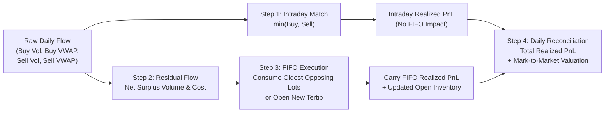

# BIST Institutional Order Flow — Tertip Mechanism (`INTRADAY_MATCHED_FIFO_V1`)

A technical and practical reference guide for tracking institutional stock inventories, immutable lot entries, intraday matching vs. carry FIFO PnL, and daily position valuations on Borsa Istanbul (BIST).

---

## 1. Why the Tertip Mechanism? (The Institutional Rationale)

In institutional order flow tracking (especially for algorithmic desks like **Bank of America `MLB`** or domestic market makers like **`IYM`, `YKR`, `AKM`, `GRM`, `ZRY`, `TRA`**), simple daily net flow (`Buy - Sell`) hides two critical realities:

1. **Intraday Market Making / Arbitrage Churn**:
   - Institutional algos frequently buy and sell large volumes of the same stock in the same session (e.g. buying 500k lots and selling 400k lots).
   - The 400k overlapping lots are cleared and settled within the day at the respective buy/sell VWAPs. This generates **realized intraday PnL** without changing the long-term carry inventory.
2. **Carried Overnight Inventory (FIFO "Tertip")**:
   - Only the un-matched residual net volume (100k lots) enters the overnight FIFO queue.
   - Each new position is an **immutable "Tertip"** (lot entry) with a fixed entry date, volume, and unit cost.
   - When a broker subsequently sells from their inventory, the **oldest open tertip** is consumed first (FIFO). 

---

## 2. Core Mathematical Formulation

Every session $T$ processes each broker-stock pair in 4 distinct mathematical steps:



### Step 1: Intraday Common Volume Matching
$$Q_{\text{matched}} = \min(Q_{\text{buy}}, Q_{\text{sell}})$$

$$\text{Value}_{\text{matched\_buy}} = \text{Turnover}_{\text{buy}} \times \frac{Q_{\text{matched}}}{Q_{\text{buy}}}$$

$$\text{Value}_{\text{matched\_sell}} = \text{Turnover}_{\text{sell}} \times \frac{Q_{\text{matched}}}{Q_{\text{sell}}}$$

$$\text{PnL}_{\text{intraday\_realized}} = \text{Value}_{\text{matched\_sell}} - \text{Value}_{\text{matched\_buy}}$$

> **Rule**: This portion clears intraday. It does **not** create, modify, or close any FIFO tertip.

---

### Step 2: Residual Flow to FIFO
- **If $Q_{\text{buy}} > Q_{\text{sell}}$ (Net Buy Surplus)**:
  $$Q_{\text{residual}} = Q_{\text{buy}} - Q_{\text{sell}}$$
  $$\text{Value}_{\text{residual}} = \text{Turnover}_{\text{buy}} - \text{Value}_{\text{matched\_buy}} = Q_{\text{residual}} \times \text{VWAP}_{\text{buy}}$$
  $$\text{Unit Cost}_{\text{residual}} = \text{VWAP}_{\text{buy}}$$
  $$\text{Direction} = \text{LONG}$$

- **If $Q_{\text{sell}} > Q_{\text{buy}}$ (Net Sell Surplus)**:
  $$Q_{\text{residual}} = -(Q_{\text{sell}} - Q_{\text{buy}})$$
  $$\text{Value}_{\text{residual}} = \text{Turnover}_{\text{sell}} - \text{Value}_{\text{matched\_sell}} = |Q_{\text{residual}}| \times \text{VWAP}_{\text{sell}}$$
  $$\text{Unit Cost}_{\text{residual}} = \text{VWAP}_{\text{sell}}$$
  $$\text{Direction} = \text{SHORT}$$

---

### Step 3: FIFO Queue Consumption & Immutable Lot Creation

For each broker-symbol position, the engine maintains two separate FIFO queues: `LONG` lots and `SHORT` lots.

1. **Consuming Opposing Queue**:
   - If incoming residual is `LONG` and open `SHORT` lots exist (or incoming is `SHORT` and open `LONG` lots exist):
   - The engine iterates through the opposing queue from **oldest to newest**:
     $$\text{Taken} = \min(Q_{\text{remaining\_residual}}, \text{Lot.RemainingQty})$$
     $$\text{Entry Value Closed} = \text{Lot.RemainingValue} \times \frac{\text{Taken}}{\text{Lot.RemainingQty}}$$
     $$\text{Exit Value} = \text{Value}_{\text{remaining\_residual}} \times \frac{\text{Taken}}{Q_{\text{remaining\_residual}}}$$
     $$\text{Lot Realized PnL} = \begin{cases} 
     \text{Exit Value} - \text{Entry Value Closed}, & \text{if closing LONG lot} \\ 
     \text{Entry Value Closed} - \text{Exit Value}, & \text{if closing SHORT lot} 
     \end{cases}$$
   - An audited realization record is logged in `silver_broker_fifo_lot_realizations`.
   - If `Lot.RemainingQty == 0`, the lot is closed (`is_final = TRUE`).

2. **Opening New Tertip**:
   - If residual quantity remains after exhausting all opposing lots:
   - A new immutable tertip record is created in `silver_broker_fifo_lot_entries` and queued in `silver_broker_fifo_lots`:
     $$\text{Opened Qty} = Q_{\text{remaining}}, \quad \text{Opened Value} = \text{Value}_{\text{remaining}}, \quad \text{Unit Cost} = \text{Unit Cost}_{\text{residual}}$$

---

### Step 4: Daily Reconciliation & Mark-to-Market (MTM)

$$\text{PnL}_{\text{daily\_realized}} = \text{PnL}_{\text{intraday\_realized}} + \text{PnL}_{\text{carry\_fifo\_realized}}$$

$$\text{Cumulative Realized PnL}_T = \text{Cumulative Realized PnL}_{T-1} + \text{PnL}_{\text{daily\_realized}}$$

$$\text{PnL}_{\text{unrealized}} = \begin{cases} 
(Q_{\text{open}} \times P_{\text{close}}) - \text{Book Cost}_{\text{open}}, & \text{if LONG} \\ 
\text{Book Proceeds}_{\text{open}} - (Q_{\text{open}} \times P_{\text{close}}), & \text{if SHORT} \\ 
0, & \text{if FLAT} 
\end{cases}$$

$$\text{PnL}_{\text{total\_daily}} = \text{PnL}_{\text{daily\_realized}} + (\text{PnL}_{\text{unrealized}, T} - \text{PnL}_{\text{unrealized}, T-1})$$

---

## 3. Step-by-Step Numerical Example

### Initial State
Broker `MLB` holds **`T1` = LONG 100 lots @ 50 TL** (Book Value: 5,000 TL).

---

### Day 1: Intraday Match + Partial FIFO Closure
- **Market Activity**: Buy 40 lots @ 10 TL (400 TL turnover), Sell 100 lots @ 20 TL (2,000 TL turnover). Close price: 20 TL.
- **Intraday Match**: 40 lots match at 20 TL sell vs 10 TL buy $\rightarrow \text{PnL}_{\text{intraday}} = 40 \times (20 - 10) = \mathbf{+400\text{ TL}}$.
- **Residual Flow**: Net 60 lots sell @ 20 TL (1,200 TL value).
- **FIFO Consumption**: Consumes 60 lots from `T1` (entry cost: $60 \times 50 = 3,000\text{ TL}$).
  $$\text{PnL}_{\text{carry\_fifo}} = 1,200 - 3,000 = \mathbf{-1,800\text{ TL}}$$
- **Day 1 Realized Result**: $+400 + (-1,800) = \mathbf{-1,400\text{ TL}}$.
- **Day 1 Ending Inventory**: `T1` entry record remains permanently **100 lots / 5,000 TL / 50 TL**. Active open balance is **40 lots / 2,000 TL / 50 TL**. Position is `LONG`.

---

### Day 2: Full Tertip Closure + Reversal to SHORT
- **Market Activity**: Net Sell 50 lots @ 60 TL (3,000 TL turnover, 0 buys). Close price: 60 TL.
- **Intraday Match**: 0 lots $\rightarrow \text{PnL}_{\text{intraday}} = 0\text{ TL}$.
- **FIFO Consumption**:
  - Closes remaining 40 lots of `T1` at 60 TL: $\text{Exit Value} = 40 \times 60 = 2,400\text{ TL}$, $\text{Entry Value} = 2,000\text{ TL}$.
    $$\text{PnL}_{\text{carry\_fifo}} = 2,400 - 2,000 = \mathbf{+400\text{ TL}}$$
  - `T1` is now fully closed (`is_final = TRUE`, status `CLOSED`).
  - Excess 10 lots sell opens **`T2` = SHORT 10 lots @ 60 TL** (Book Proceeds: 600 TL).
- **Day 2 Realized Result**: $\mathbf{+400\text{ TL}}$. Ending Position: `SHORT 10 lots @ 60 TL`.

---

### Day 3: Covering SHORT Position back to FLAT
- **Market Activity**: Net Buy 10 lots @ 55 TL (550 TL turnover, 0 sells). Close price: 55 TL.
- **FIFO Consumption**:
  - Covers `T2` (10 lots short @ 60 TL with 550 TL cover cost):
    $$\text{PnL}_{\text{carry\_fifo}} = 600 - 550 = \mathbf{+50\text{ TL}}$$
  - `T2` is now fully closed (`is_final = TRUE`, status `CLOSED`).
- **Day 3 Realized Result**: $\mathbf{+50\text{ TL}}$. Ending Position: `FLAT`.

### Summary Matrix
| Session | Intraday PnL | Carry FIFO PnL | Daily Realized PnL | Cumulative Realized PnL | Active Position |
| :--- | :---: | :---: | :---: | :---: | :--- |
| **Start** | — | — | — | 0 TL | `T1: LONG 100 @ 50 TL` |
| **Day 1** | +400 TL | -1,800 TL | -1,400 TL | -1,400 TL | `T1: LONG 40 @ 50 TL` |
| **Day 2** | 0 TL | +400 TL | +400 TL | -1,000 TL | `T2: SHORT 10 @ 60 TL` |
| **Day 3** | 0 TL | +50 TL | +50 TL | -950 TL | `FLAT (0 lots)` |

---

## 4. Silver Lakehouse Table Reference & Point-in-Time Architecture

The Tertip engine populates 5 dedicated tables in DuckDB:

| Table Name | Primary Key / Granularity | Description & Key Columns |
| :--- | :--- | :--- |
| **`silver_broker_fifo_daily`** | `(trade_date, symbol, broker_id)` | **Point-in-Time Historical Time-Series**: Full end-of-day snapshot for every trading date $T$. Logs daily matched volume, intraday PnL, residual flow, carry FIFO PnL, open stock inventory, average unit cost, close price, MTM market value, unrealized PnL, and cumulative realized PnL. Downstream models query `WHERE trade_date = T` with **zero lookahead leakage**. |
| **`silver_broker_fifo_lot_entries`** | `lot_id` | **Immutable entry records** created once at lot opening (`opened_quantity`, `opened_value_tl`, `opened_unit_cost`, `open_date`, `direction`). |
| **`silver_broker_fifo_lots`** | `lot_id` | **Currently active open lots** with remaining balance as of the latest completed session (`remaining_quantity`, `remaining_value_tl`, `unit_cost`). |
| **`silver_broker_fifo_lot_realizations`** | `realization_id` | **Audited closure events** logging partial and full lot exits (`quantity_closed`, `entry_value_closed_tl`, `closing_value_tl`, `realized_pnl_tl`, `remaining_quantity_after`, `is_final`). |
| **`silver_broker_fifo_lot_lifecycle`** | `lot_id` | **Consolidated lifecycle summary** combining open metrics, closure totals, realization PnL, and status (`OPEN` or `CLOSED`). |

> **Dataset Scope & Scaling**: Row counts in the local repository (e.g. 48,058 daily rows, 29,613 lots) reflect the baseline sample dataset (March 2026 / 21 trading days / 36.8M+ trades). In production environments, the engine ingests multi-year trading feeds, scaling time-series ledgers and lot queues seamlessly across millions of trades and years of history.


---

## 5. Primary Tracked Institutional Universe

- **Foreign Institutional Primary Target**:
  - `MLB`: Bank of America (BofA)
- **Top Domestic Major Desks**:
  - `IYM`: İş Yatırım
  - `YKR`: Yapı Kredi Yatırım
  - `AKM`: Ak Yatırım
  - `GRM`: Garanti BBVA Yatırım
  - `ZRY`: Ziraat Yatırım
- **Key Domestic Institutional / Momentum Broker**:
  - `TRA`: Tera Yatırım Menkul Değerler
- **Equities Universe**:
  - All **BIST 30** liquid equities (e.g. `AKBNK`, `GARAN`, `ISCTR`, `YKBNK`, `THYAO`, `TUPRS`, `KCHOL`, `SAHOL`, `BIMAS`, `EREGL`, `ASELS`, `ASTOR`, `SASA`, `PETKM`, `PGSUS`, `SISE`, `HALKB`, `TCELL`, `EKGYO`, `KRDMD`, `FROTO`, `VAKBN`, `TOASO`, `ENKAI`, `TTKOM`, `AEFES`, `TAVHL`, `ARCLK`).

---

## 6. Quick DuckDB Analytical Recipes

### Query 1: BofA Active Open Stock Positions and Average Cost
```sql
SELECT 
    symbol,
    position_side,
    open_stock_quantity,
    open_fifo_cost_tl,
    fifo_avg_cost,
    market_close_price,
    unrealized_pnl_tl,
    cumulative_realized_pnl_tl
FROM silver_broker_fifo_daily
WHERE broker_id = 'MLB' 
  AND trade_date = '2026-03-31' 
  AND position_side != 'FLAT'
ORDER BY ABS(open_fifo_cost_tl) DESC;
```

### Query 2: Inspect Lot Lifecycle for Tera Yatırım (`TRA`) on `THYAO`
```sql
SELECT 
    lot_id,
    direction,
    open_date,
    opened_quantity,
    opened_unit_cost,
    status,
    closed_date,
    total_realized_pnl_tl,
    remaining_quantity
FROM silver_broker_fifo_lot_lifecycle
WHERE broker_id = 'TRA' AND symbol = 'THYAO'
ORDER BY open_date DESC;
```

### Query 3: Compare Cumulative Realized PnL Across Key Desks
```sql
SELECT 
    broker_id,
    broker_name,
    SUM(daily_realized_pnl_tl) AS total_realized_pnl_tl,
    SUM(intraday_realized_pnl_tl) AS total_intraday_pnl_tl,
    SUM(carry_fifo_realized_pnl_tl) AS total_carry_fifo_pnl_tl
FROM silver_broker_fifo_daily
WHERE broker_id IN ('MLB', 'IYM', 'YKR', 'AKM', 'GRM', 'ZRY', 'TRA')
GROUP BY broker_id, broker_name
ORDER BY total_realized_pnl_tl DESC;
```
